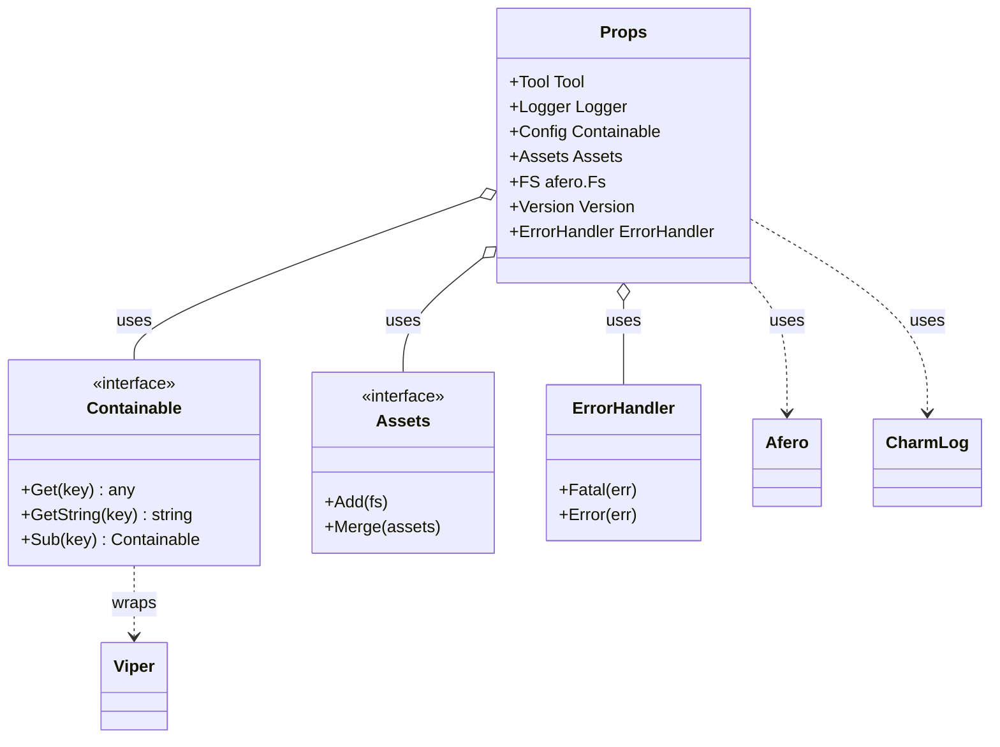
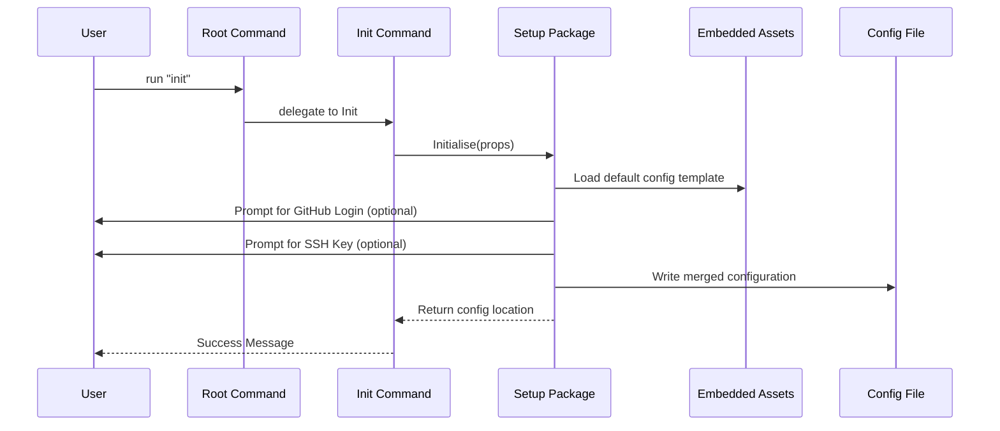

# Architectural Overview

This guide provides a high-level view of how the various components of GTB interact to create a cohesive CLI framework.

## Component Relationships

At the heart of every GTB application is the `Props` container, which orchestrates the primary services. The following diagram illustrates the relationships between these core components:

## Core Workflows

### 1. Application Initialization

When a user runs the `init` command, the framework performs a multi-stage bootstrapping process:

### 2. Dependency Injection Flow

Dependencies are injected from the entry point (`main.go`) through the `Props` struct:

1.  **Creation**: `Props` is instantiated with the basic environment (Logger, Version).
2.  **Configuration**: The `config` package loads settings into `Props.Config`.
3.  **Command Wiring**: Subcommands are created with a reference to `Props`, giving them immediate access to all services.
4.  **Execution**: Commands use `Props.ErrorHandler` to ensure consistent terminal output and exit codes.

### 3. Signal-aware Execution Lifecycle

`root.Execute` is the single execution entry point for every GTB tool, and it owns the process lifecycle from launch to exit:

1.  **Context derivation**: A cancellable context watching SIGINT and SIGTERM is derived and passed to Cobra via `ExecuteContext`, so every command's `cmd.Context()` observes interruption.
2.  **Graceful cancellation**: The first signal cancels the context; commands unwind by honouring `ctx.Done()`. A second signal force-exits immediately (the `kubectl`/`docker` UX).
3.  **Cleanup**: The buffered telemetry flush runs on every path — success, error, and cancellation — using a bounded background context so cancellation cannot abort the flush itself.
4.  **Exit codes**: Errors exit `1`; signal-terminated runs exit `128 + signum` (130/143). Both are routed through the `ErrorHandler`'s exit path (`errorhandling.WithExitCode`), keeping a single `os.Exit` call site.

While an interactive TUI prompt is active the terminal is in raw mode, so Ctrl-C is delivered as a keystroke that aborts the prompt — the outer signal context only reacts to real OS signals. See the [Root Command documentation](../components/commands/root.md#signal-handling) for details.

## Design Principles

*   **Explicit over Implicit**: We prefer passing `Props` over using `context.Context` for dependencies (see [Props documentation](../components/props.md) for the rationale).
*   **Interface Segregation**: Core services (Config, Assets, VCS) are defined by interfaces to enable clean mocking in unit tests.
*   **Consistent Error Handling**: All user-facing errors funnel through the `ErrorHandler` to maintain a unified look and feel.
*   **Registry over hard-coding**: The release provider system uses a string-keyed factory registry (`pkg/vcs/release`) so that consuming code (and downstream tools) never need to import platform packages directly. Built-in providers register themselves via `init()` blank imports in `pkg/setup/providers.go`; custom providers call `release.Register` in `main()` before any update operation runs.
