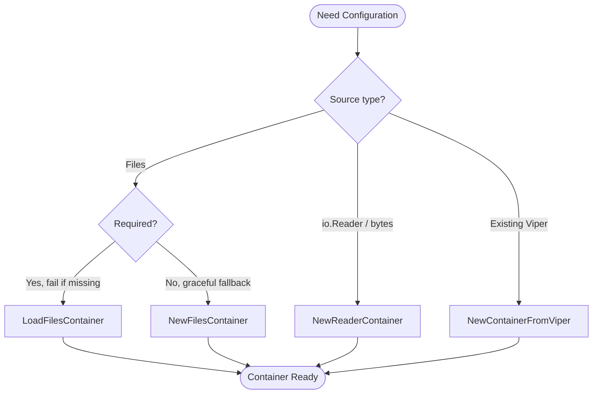

# Configuration

The Configuration component provides a flexible and powerful abstraction over the `spf13/viper` configuration library. It delivers enhanced functionality for configuration loading and management while adding crucial testability features that are not available with viper directly.

## Overview

The configuration system is built around the `Containable` interface and the `Container` struct, providing a unified API for accessing configuration values regardless of their source. The package adds several key improvements over raw viper usage:

**Enhanced Testability**: Unlike viper, which is difficult to mock effectively, the `Containable` interface enables clean dependency injection and comprehensive testing strategies.

**Observer Pattern**: Adds filesystem watching with an observer pattern for configuration changes, allowing your application to react to configuration updates automatically.

**Simplified API**: Provides convenience methods for common configuration tasks while maintaining access to the underlying viper instance when needed.

**Multiple Source Support**: Handles configuration loading from files, embedded resources, environment variables, and command-line flags with automatic merging and type conversion.

## Why use the Wrapper?

Instead of industrializing Viper directly in your application code, GTB provides the `Containable` interface. This allows us to:

- **Enforce Consistency**: Methods like `NewFilesContainer` ensure that every CLI tool follows the same logic for loading and merging configuration files.
- **Abstract the Filesystem**: We integrate natively with `afero`, meaning your configuration can be loaded from the OS, an in-memory test buffer, or embedded assets through the same interface.
- **Automate Environment Mapping**: We pre-configure environment variable replacement (e.g., `server.port` becomes `SERVER_PORT`) so you don't have to.

## Core Interface

The `Containable` interface provides the primary API for configuration access:


> [!NOTE]
> See [pkg.go.dev/gitlab.com/phpboyscout/go-tool-base/pkg/config](https://pkg.go.dev/gitlab.com/phpboyscout/go-tool-base/pkg/config) for the full API definition.


## Container Implementation

The `Container` struct is the primary implementation of the `Containable` interface. Engineers should use this concrete type rather than the interface directly, except for testing and dependency injection:

```go
type Container struct {
    ID        string
    viper     *viper.Viper
    logger    logger.Logger
    observers []Observable
}

// Core factory functions (options pattern):
func NewFilesContainer(fs afero.Fs, opts ...ContainerOption) *Container
func NewReaderContainer(fs afero.Fs, opts ...ContainerOption) *Container
```

### Container Options

All factory functions accept functional options to configure container behavior. The only required argument is `fs afero.Fs`:

```go
config.WithLogger(l logger.Logger)             // Logger (default: noop)
config.WithEnvPrefix(prefix string)            // Env var prefix (default: none)
config.WithConfigFiles(files ...string)        // Config file paths
config.WithConfigFormat(format string)         // "yaml", "json", "toml"
config.WithConfigReaders(readers ...io.Reader) // io.Reader config sources
config.WithSchema(schema *Schema)              // Validation schema
```

---

## Factory Function Selection Guide

GTB provides several factory functions for creating configuration containers. This section helps you choose the right one for your use case.

### Quick Reference

| Factory Function | Use Case | Error Handling | File Watching |
| :--- | :--- | :--- | :--- |
| `NewFilesContainer(fs, opts...)` | Application startup with optional files | Logs warnings, continues | ✓ Enabled |
| `LoadFilesContainer(fs, opts...)` | Strict loading where config is required | Returns error | ✗ Disabled |
| `LoadFilesContainerWithSchema(fs, schema, opts...)` | Strict loading with schema validation | Returns error | ✗ Disabled |
| `NewReaderContainer(fs, opts...)` | Testing or embedded config streams | Logs warnings, continues | ✗ Disabled |
| `NewContainerFromViper(l, v)` | Wrapping existing Viper instances | N/A | Depends on Viper |

### NewFilesContainer

**Best for:** Production applications where some config files may not exist.

```go
container := config.NewFilesContainer(fs,
    config.WithLogger(l),
    config.WithConfigFiles("config.yaml", "config.local.yaml"),
)
```

**Behavior:**

- Silently continues if files don't exist
- Logs warnings for parse errors but doesn't fail
- Automatically enables file watching for hot-reload
- Merges files in order (later files override earlier ones)

### LoadFilesContainer

**Best for:** Scenarios where configuration is mandatory.

```go
container, err := config.LoadFilesContainer(fs,
    config.WithLogger(l),
    config.WithConfigFiles("config.yaml", "config.local.yaml"),
)
if err != nil {
    return fmt.Errorf("configuration required: %w", err)
}
```

**Behavior:**

- Returns `ErrConfigFileNotFound` (match with `errors.Is`) if the **first** file doesn't exist — never a nil container with a nil error
- Subsequent files are optional (merged if present)
- No file watching (single load operation)
- Preferred for CLI tools that require explicit configuration

### NewReaderContainer

**Best for:** Testing and programmatic configuration.

```go
// From strings (testing)
configYAML := `
app:
  name: test-app
  debug: true
`
container := config.NewReaderContainer(fs,
    config.WithLogger(l),
    config.WithConfigFormat("yaml"),
    config.WithConfigReaders(strings.NewReader(configYAML)),
)

// From embedded bytes
container := config.NewReaderContainer(fs,
    config.WithLogger(l),
    config.WithConfigFormat("yaml"),
    config.WithConfigReaders(
        bytes.NewReader(defaultConfigBytes),
        bytes.NewReader(envSpecificBytes),
    ),
)
```

**Behavior:**

- Accepts `io.Reader` instead of file paths
- Must specify format explicitly ("yaml", "json", "toml")
- No file watching (readers are consumed once)
- Ideal for unit tests with controlled configuration

### NewContainerFromViper

**Best for:** Integration with existing Viper-based code.

```go
// When you already have a configured Viper instance
v := viper.New()
v.SetConfigFile("legacy-config.yaml")
v.ReadInConfig()

container := config.NewContainerFromViper(l, v)
```

**Behavior:**

- Wraps existing Viper without modification
- Inherits all Viper settings (watchers, env bindings, etc.)
- Useful for gradual migration to GTB patterns

### Decision Flowchart



---

## Configuration Sources

### 1. File-Based Configuration

Load configuration from YAML files using the simplified `Load` function or create containers directly:

```go
// Using the convenience Load function
fs := afero.NewOsFs()
paths := []string{"config.yaml", "config.yml", "/etc/myapp/config.yaml"}

container, err := config.Load(paths, fs, false,
    config.WithLogger(l),
)
if err != nil {
    log.Fatal(err)
}

// Or create a Container directly
container := config.NewFilesContainer(fs,
    config.WithLogger(l),
    config.WithConfigFiles("config.yaml", "local.yaml"),
)
```

**Example config.yaml:**
```yaml
app:
  name: "my-application"
  debug: false
  port: 8080

database:
  host: "localhost"
  port: 5432
  name: "myapp"
  timeout: "30s"

features:
  - "auth"
  - "logging"
  - "metrics"
```

### 2. Embedded Configuration

Load configuration from embedded files (useful for default configurations). The library supports loading and merging configurations from multiple embedded filesystem instances.

!!! warning "Naming Convention & Path Requirement"
    For automated configuration loading and merging (especially during `init`), the library expects the following structure within your `embed.FS`:

    *   **Path**: `assets/init/config.yaml`
    *   **Embed Directive**: `//go:embed assets/*` (ensure all subdirectories are included)

### Root Command Integration

When building a modular CLI where each subcommand manages its own configuration, you should collect all assets into a slice and pass them to the root command creator:

```go
// pkg/cmd/root/root.go

//go:embed assets/*
var assets embed.FS

func NewCmdRoot(props *props.Props) *cobra.Command {
    // 1. Initialize subcommands and collect their assets
    trainCmd, trainAssets := train.NewCmdTrain(props)
    kubeCmd, kubeAssets := kube.NewCmdKube(props)

    // 2. Aggregate all assets (root assets + subcommand assets)
    allAssets := []embed.FS{assets}
    for _, a := range []*embed.FS{trainAssets, kubeAssets} {
        if a != nil {
            allAssets = append(allAssets, *a)
        }
    }

    // 3. Create the root command with the full slice of assets
    // This allows the configuration system to search across ALL modules
    rootCmd := root.NewCmdRoot(props, allAssets)

    // 4. Add the subcommands to the root
    rootCmd.AddCommand(trainCmd)
    rootCmd.AddCommand(kubeCmd)

    return rootCmd
}
```

The library searches all provided assets for the `assets/init/config.yaml` path and merges them together during both application startup and the `init` command process.

### 3. Environment Variable Integration

The Container automatically handles environment variables using viper's built-in functionality:

```go
// Environment variables are automatically mapped
// For config key "database.host", environment variable "DATABASE_HOST" is checked
// Key separator "." is replaced with "_" in environment variable names

container := config.NewFilesContainer(fs,
    config.WithLogger(l),
    config.WithConfigFiles("config.yaml"),
)

// This will check DATABASE_HOST environment variable
host := container.GetString("database.host")
```

### Environment Variable Prefix

By default, config keys map directly to environment variable names (e.g., `ai.provider` resolves from `AI_PROVIDER`). When `WithEnvPrefix` is set, all environment variable lookups are prefixed to prevent config pollution in shared environments:

```go
container := config.NewFilesContainer(fs,
    config.WithLogger(l),
    config.WithEnvPrefix("GTB"),
    config.WithConfigFiles("config.yaml"),
)

// With prefix "GTB", config key "ai.provider" resolves from GTB_AI_PROVIDER
// instead of AI_PROVIDER
provider := container.GetString("ai.provider")
```

The prefix is typically set via `Props.Tool.EnvPrefix` at the root command level, which propagates it to all configuration containers created during command execution. This is especially useful when multiple CLI tools share the same host environment and would otherwise collide on generic variable names like `LOG_LEVEL` or `AI_PROVIDER`.

### 4. Local Dotenv Support

For local development, the configuration system automatically looks for and loads environment variables from a `.env` file in the current working directory.

!!! tip "Local Overrides"
    The `.env` loader is initialized automatically by every `Container`. This is the recommended way to manage local API keys and tokens without modifying your `config.yaml`.

### 5. Configuration Merging

Combine multiple configuration files with automatic merging:

```go
// Multiple files are merged in order, with later files taking precedence
container := config.NewFilesContainer(fs,
    config.WithLogger(l),
    config.WithConfigFiles(
        "defaults.yaml",    // Base configuration
        "config.yaml",      // Environment-specific
        "local.yaml",       // Local overrides
    ),
)

// The Load function also supports merging from multiple discovered files
paths := []string{"config.yaml", "config.local.yaml", "/etc/myapp/config.yaml"}
container, err := config.Load(paths, fs, false,
    config.WithLogger(l),
)
```

## Usage Examples

### Basic Value Access

```go
// Simple value access
appName := container.GetString("app.name")
debugMode := container.GetBool("app.debug")
port := container.GetInt("app.port")

// Type conversion with automatic handling
timeout := container.GetDuration("database.timeout") // "30s" -> 30 * time.Second
startTime := container.GetTime("app.start_time")
maxSize := container.GetFloat("cache.max_size")

// Check if a key exists
if container.Has("feature.experimental") {
    experimental := container.GetBool("feature.experimental")
    // Handle experimental feature
}
```

### Hierarchical Configuration

```go
// Access nested configuration sections using Sub()
dbConfig := container.Sub("database")
if dbConfig != nil {
    host := dbConfig.GetString("host")
    port := dbConfig.GetInt("port")
    name := dbConfig.GetString("name")

    connectionString := fmt.Sprintf("%s:%d/%s", host, port, name)
}

// Sub returns a new Containable for the nested section
cacheConfig := container.Sub("cache")
redisConfig := cacheConfig.Sub("redis") // Nested: cache.redis.*
```

#### Environment-Aware `Sub()`

Viper's native `Sub()` returns a fresh `*viper.Viper` that does **not** inherit the parent's `AutomaticEnv` + `SetEnvPrefix` configuration. That would quietly strip prefix-aware env binding from every sub-container — so `cfg.Sub("github").GetString("auth.value")` would miss `<TOOL>_GITHUB_AUTH_VALUE` even though the top-level `cfg.GetString("github.auth.value")` resolves it correctly.

The GTB `Container.Sub()` avoids that trap. The returned view:

1. Keeps a **structural view** — Viper's own `Sub` sub-tree — used for `WriteConfigAs`, `Dump`, `ToJSON`, and `Validate` so those operations remain scoped to the sub-path.
2. Tracks the **root container** and an accumulated dot-prefix, and routes every `Get*`, `Set`, `Has`, and `IsSet` call through the root's Viper with a qualified key path. `AutomaticEnv` + prefix binding continue to fire no matter how many `Sub()` layers a caller walks.

```go
// With env prefix "MYTOOL" and GTB_GITHUB_AUTH_VALUE=ghp_xxx in env:
github := cfg.Sub("github")
github.GetString("auth.value")  // -> "ghp_xxx" (via AutomaticEnv)

// Nested Sub accumulates the full prefix:
bitbucket := cfg.Sub("bitbucket")
auth := bitbucket.Sub("auth")
auth.GetString("token")         // qualifies to "bitbucket.auth.token"
```

`Sub()` still returns `nil` when the key is absent from the entire config hierarchy (file, defaults, flags) — existing `if sub != nil` guards continue to work. The env-aware delegation only kicks in for sub-containers that were returned non-nil.

**When this matters:** any code that passes `cfg.Sub(...)` into a resolver — `pkg/vcs/auth.ResolveToken`, `pkg/vcs/github.NewGitHubClient`, `pkg/vcs/bitbucket.resolveCredentials`, `pkg/setup/update.requireReleaseToken` — benefits automatically. A prefixed env var set by the user (e.g. `MYTOOL_GITHUB_AUTH_VALUE`, `MYTOOL_GITLAB_AUTH_VALUE`) is honoured without any caller changes.

Configuration works seamlessly with Cobra flags:

```go
func NewDatabaseCommand(props *props.Props) *cobra.Command {
    var dbHost string

    cmd := &cobra.Command{
        Use:   "database",
        Short: "Database operations",
        RunE: func(cmd *cobra.Command, args []string) error {
            // Flag takes precedence over config
            if dbHost == "" {
                dbHost = props.Config.GetString("database.host")
            }

            props.Logger.Info("Connecting to database", "host", dbHost)
            return nil
        },
    }

    cmd.Flags().StringVar(&dbHost, "db-host", "", "Database host")

    return cmd
}
```

The manual `if dbHost == ""` dance above is only needed when a flag is **not** bound to a config key. The recommended approach is to bind the flag so `props.Config.Get*` resolves precedence for you — see [Binding CLI flags to config](#binding-cli-flags-to-config).

### Binding CLI flags to config

GTB documents a configuration precedence of **flags > env > file > embedded > defaults**. For a CLI flag to participate in that precedence, it must be *bound* to a configuration key. Binding wires the flag into viper via `BindPFlag` during config load, after the file and env layers are established, so viper's native order (`BindPFlag` above `AutomaticEnv`) yields the documented result.

Register bound flags on the root command using the `RootOption`s:

```go
portFlags := pflag.NewFlagSet("server", pflag.ContinueOnError)
portFlags.Int("server-port", 8080, "server port")

rootCmd := root.NewCmdRootWithOptions(props,
    // Explicit map: config key -> flag.
    root.WithBoundFlags(map[string]*pflag.Flag{
        "server.port": portFlags.Lookup("server-port"),
    }),
)
```

For zero-boilerplate binding, use the convention helper, which derives the config key from the flag name by replacing hyphens with dots (`--server-port` → `server.port`):

```go
rootCmd := root.NewCmdRootWithOptions(props,
    root.WithConventionBoundFlags(portFlags), // binds every flag in the set
)
```

Both options register the supplied flags on the root command's persistent flag set, so cobra parses them and GTB binds them during the pre-run.

**Per-command flags** are bound automatically: a subcommand's own *local* flags are mapped by the same hyphen-to-dot convention when that command runs, so `mytool serve --server-port 9090` overrides `server.port` for the `serve` command's `RunE`.

**Only changed flags are bound.** A flag the user did *not* set on the command line is filtered out (`flag.Changed == false`) and never overrides config — this avoids viper's classic default-clobber footgun where binding a defaulted flag silently masks file/env values.

The built-in `--debug` and `--ci` flags are folded through the same binding path, so `Config.GetBool("ci")` reflects `--ci`. `--debug` additionally retains its immediate effect on the log level.

To bind a flag directly onto a container (advanced; the options above are preferred), use `Containable.BindPFlag`:

```go
// key, flag — bind only when flag.Changed is true.
if flag.Changed {
    _ = props.Config.BindPFlag("server.port", flag)
}
```

## Advanced Features

### Schema Validation

The `Container` supports **decentralised, per-package** schema validation using struct tags. Each package defines a struct describing the config keys it consumes and validates its own slice of the config — there is no centralised schema for the entire config tree.

This design aligns with GTB's config architecture where defaults live in embedded assets and each feature package owns its config independently.

!!! note "Defaults vs Validation"
    Default values belong in your package's embedded `assets/init/config.yaml`, not in struct tags. The `default` tag is retained for documentation and error hints only — the validation layer does not inject defaults.

**Struct tag reference:**

| Tag | Purpose | Example |
|-----|---------|---------|
| `config:"key"` | Maps field to config key | `config:"github.token"` |
| `validate:"required"` | Field must be present and non-zero | `validate:"required"` |
| `enum:"a,b,c"` | Restricts to allowed values | `enum:"debug,info,warn,error"` |
| `default:"value"` | Documentation only (used in hints) | `default:"info"` |

**Per-package validation (recommended pattern):**

Each package defines a config struct and validates the keys it owns with the
generic `ValidateStruct[T]` helper, which derives the schema from the struct's
tags and runs it against the container:

```go
// pkg/myfeature/config.go
type Config struct {
    APIKey   string `config:"myfeature.api_key" validate:"required"`
    Endpoint string `config:"myfeature.endpoint" validate:"required"`
    LogLevel string `config:"myfeature.log_level" enum:"debug,info,warn,error" default:"info"`
}

func ValidateConfig(cfg config.Containable) error {
    return config.ValidateStruct[Config](cfg)
}
```

`ValidateStruct[T]` takes the `Containable` interface, so there is no need to
type-assert `Props.Config` down to the concrete `*Container`. Schema options pass
straight through, e.g. `config.ValidateStruct[Config](cfg, config.WithStrictMode())`.
When you need the `*Schema` itself (for hot-reload gating via `SetSchema`, say),
build it with `config.SchemaOf[Config]()`, which caches the schema per type.

**Load-time validation (for CLI tools):**

```go
schema, err := config.NewSchema(config.WithStructSchema(AppConfig{}))
if err != nil {
    return err
}

cfg, err := config.LoadFilesContainerWithSchema(fs, schema,
    config.WithLogger(l),
    config.WithConfigFiles("config.yaml"),
)
if err != nil {
    // "config validation failed:
    //   myfeature.api_key: required field is missing (hint: ... set the MYFEATURE_API_KEY environment variable)"
    return err
}
```

**Validation on an existing container:**

```go
container := config.NewFilesContainer(fs,
    config.WithLogger(l),
    config.WithConfigFiles("config.yaml"),
)
result := container.Validate(schema)
if !result.Valid() {
    fmt.Println(result.Error())
}
// Warnings (unknown keys) are available via result.Warnings
```

**Schema options:**

| Option | Description |
|--------|-------------|
| `WithStructSchema(v any)` | Derive schema from struct tags |
| `WithStrictMode()` | Treat unknown keys as errors (default: warnings) |

**Generic helpers:**

| Function | Description |
|----------|-------------|
| `SchemaOf[T](opts ...SchemaOption)` | Build a schema from `T`'s struct tags; caches the option-free result per type |
| `ValidateStruct[T](cfg Containable, opts ...SchemaOption)` | Validate `cfg` against `T`'s schema without a manual `*Container` cast |

**Hot-reload integration:** Attach a schema to a container via `container.SetSchema(schema)`. When config files change, validation runs before notifying observers. Invalid reloads are rejected and logged.

For a complete walkthrough of defining config defaults AND validation for a new component, see the [Validate Component Config](../../how-to/validate-component-config.md) how-to guide.

## Observer Pattern for Configuration Changes

The configuration system includes a built-in observer pattern. The file-backed
`Container` runs its own `fsnotify` watcher over **every** configured file. On a
change it rebuilds and re-merges all files into a candidate, validates the
candidate against the schema (if any), and — only on success — swaps the live
config atomically and notifies observers. A reload that fails to parse any file
or fails validation is rejected **fail-closed**: the last-known-good config is
retained, `Get*` keeps serving the previous values, and observers are not
notified. Save bursts are coalesced behind a configurable debounce window
(default 250 ms; see `WithReloadDebounce`).

### Observable Interface

`Run` returns an `error`. A returned error is logged by the framework; it does
not abort subsequent observers and never stalls future reloads. (This replaced
the previous `chan error` parameter — see the
[migration guide](../../reference/migration/v0.16-hot-reload-observer.md).)


> [!NOTE]
> See [pkg.go.dev/gitlab.com/phpboyscout/go-tool-base/pkg/config](https://pkg.go.dev/gitlab.com/phpboyscout/go-tool-base/pkg/config) for the full API definition.


### Adding Observers

Register observers to react to configuration changes:

```go
// Using the Observable interface
type ConfigWatcher struct {
    name string
}

func (cw *ConfigWatcher) Run(cfg config.Containable) error {
    // React to configuration changes
    newPort := cfg.GetInt("app.port")
    fmt.Printf("Configuration updated - new port: %d\n", newPort)

    // Return any error; it is logged by the framework
    if newPort < 1024 {
        return fmt.Errorf("invalid port number: %d", newPort)
    }

    return nil
}

// Register the observer
watcher := &ConfigWatcher{name: "port-monitor"}
container.AddObserver(watcher)

// Or use a function directly
container.AddObserverFunc(func(cfg config.Containable) error {
    l.Info("Configuration reloaded", "timestamp", time.Now())

    return nil
})
```

### Automatic File Watching

Every file-backed container is watched — single-file as well as multi-file —
once construction completes:

```go
// This enables file watching automatically
container := config.NewFilesContainer(fs,
    config.WithLogger(l),
    config.WithConfigFiles("config.yaml", "local.yaml"),
    config.WithReloadDebounce(500*time.Millisecond), // optional; default 250ms
)
defer container.Close() // stop the watcher and release OS resources

// File watching triggers observers when either file changes
container.AddObserverFunc(func(cfg config.Containable) error {
    // Called whenever config.yaml or local.yaml changes, after the merged
    // candidate has validated and been swapped in.
    newLogLevel := cfg.GetString("log.level")
    // Reconfigure logging, restart services, etc.
    _ = newLogLevel

    return nil
})
```

### Reacting to rejected reloads

Observers are notified only when a reload **succeeds** — the candidate config
was built, passed schema validation, and was swapped in. They are never handed
a rejected reload, because nothing changed and the returned-error contract has
no channel to push a reload-time error back to an observer.

To learn about a **rejected** reload programmatically, register an
`OnReloadError` callback. It fires whenever a reload is rejected and the
last-known-good config is retained — that is, when:

- the candidate failed to build (a fail-closed partial-merge / parse error, or
  the primary file went missing, honouring `ErrConfigFileNotFound`); or
- the candidate failed schema validation.

```go
container := config.NewFilesContainer(fs,
    config.WithLogger(l),
    config.WithConfigFiles("config.yaml", "local.yaml"),
    config.WithSchema(schema),
)

// Fires on a CHANGE that was applied.
container.AddObserverFunc(func(cfg config.Containable) error {
    // apply the new, validated configuration
    return nil
})

// Fires on a CHANGE that was REJECTED (config unchanged, last-known-good kept).
container.OnReloadError(func(err error) {
    l.Warn("config reload rejected; keeping last-known-good", "error", err)
    // e.g. raise an alert, bump a metric, surface a banner
})
```

**Guarantees and ordering**

- The container always logs the rejection at `ERROR`; `OnReloadError` callbacks
  are **additive** to that log, not a replacement.
- `OnReloadError` is **never** invoked for a successful reload; observers are.
- Callbacks are stored under the container mutex, copied under the lock, and
  invoked **outside** the lock (the same race-safe, deadlock-free discipline as
  observer notification), so registering a callback concurrently with an active
  reload is safe under `-race`.
- Callbacks run in registration order on the watcher goroutine; a slow callback
  delays subsequent reloads, so offload expensive work.

## Testing and Mocking

One of the primary benefits of the config package is enhanced testability. Unlike viper, which is difficult to mock, the `Containable` interface enables comprehensive testing strategies.

### Creating Test Configurations

```go
func TestMyFunction(t *testing.T) {
    // Create in-memory configuration for testing
    fs := afero.NewMemMapFs()

    // Using a YAML string for test config
    testConfigYAML := `
app:
  name: "test-app"
  debug: true
  port: 8080
database:
  host: "localhost"
  port: 5432
  name: "testdb"
`

    container := config.NewReaderContainer(fs,
        config.WithConfigFormat("yaml"),
        config.WithConfigReaders(strings.NewReader(testConfigYAML)),
    )

    // Test your function with the test configuration
    result := MyFunctionThatNeedsConfig(container)
    assert.Equal(t, "expected", result)
}
```

### Mock Configuration Interface

The GTB library includes auto-generated mocks using [mockery](https://github.com/vektra/mockery). **Use these provided mocks instead of creating manual implementations:**

```go
import (
    "testing"

    "gitlab.com/phpboyscout/go-tool-base/mocks/pkg/config"
    "github.com/stretchr/testify/assert"
)

func TestWithProvidedMocks(t *testing.T) {
    // Use the auto-generated mock
    mockConfig := config.NewMockContainable(t)

    // Set up expectations
    mockConfig.EXPECT().GetString("database.host").Return("test-host")
    mockConfig.EXPECT().GetInt("database.port").Return(5432)
    mockConfig.EXPECT().GetString("database.name").Return("testdb")
    mockConfig.EXPECT().Has("database.ssl").Return(true)
    mockConfig.EXPECT().GetBool("database.ssl").Return(false)

    // Test your function
    service := NewDatabaseService(mockConfig)
    err := service.Connect()
    assert.NoError(t, err)

    // Expectations are automatically verified on cleanup
}

func TestConfigSubSection(t *testing.T) {
    mockConfig := config.NewMockContainable(t)
    mockSubConfig := config.NewMockContainable(t)

    // Mock Sub() method to return another mock
    mockConfig.EXPECT().Sub("database").Return(mockSubConfig)
    mockSubConfig.EXPECT().GetString("host").Return("localhost")
    mockSubConfig.EXPECT().GetInt("port").Return(5432)

    // Use the mocked configuration
    dbConfig := mockConfig.Sub("database")
    host := dbConfig.GetString("host")
    port := dbConfig.GetInt("port")

    assert.Equal(t, "localhost", host)
    assert.Equal(t, 5432, port)
}
```

### Available Generated Mocks

The library provides the following auto-generated mocks in the `mocks/config` package:

- **`MockContainable`** - Mock implementation of the `Containable` interface
- **`MockObservable`** - Mock implementation of the `Observable` interface
- **`MockEmbeddedFileReader`** - Mock implementation of the `EmbeddedFileReader` interface

**Benefits of Using Provided Mocks:**

- **Type Safety**: Automatically generated from the actual interfaces
- **Comprehensive**: All interface methods are properly mocked
- **Test Integration**: Built-in support for testify assertions and cleanup
- **Maintenance**: Updated automatically when interfaces change

### Testing Observer Behavior

Testing observers is important because they often contain critical business logic that responds to configuration changes. Since observers in production are triggered by filesystem changes, testing requires special approaches.

#### Why Test Observers?

- **Critical Logic**: Observers often restart services, update logging levels, or reconfigure security settings
- **Error Handling**: Observers signal configuration validation errors via the returned `error`
- **Direct invocation**: Observers can be exercised by calling `Run(cfg)` directly — no file watching required

#### Testing Strategies

**1. Testing Observer Logic with Mock Configurations:**

```go
import (
    "testing"

    "gitlab.com/phpboyscout/go-tool-base/mocks/pkg/config"
    "github.com/stretchr/testify/assert"
    "github.com/stretchr/testify/require"
)

func TestLogLevelObserver(t *testing.T) {
    mockConfig := config.NewMockContainable(t)
    mockConfig.EXPECT().GetString("log.level").Return("debug")

    observerCalled := false

    observer := &LogLevelObserver{
        onLevelChange: func(level string) {
            observerCalled = true
            assert.Equal(t, "debug", level)
        },
    }

    require.NoError(t, observer.Run(mockConfig))
    assert.True(t, observerCalled)
}
```

**2. Testing Observer Registration and Integration:**

```go
func TestObserverRegistration(t *testing.T) {
    fs := afero.NewMemMapFs()

    container := config.NewReaderContainer(fs,
        config.WithConfigFormat("yaml"),
        config.WithConfigReaders(strings.NewReader(`
log:
  level: "info"
database:
  host: "localhost"
`)),
    )

    observerCalled := false

    container.AddObserverFunc(func(cfg config.Containable) error {
        observerCalled = true

        logLevel := cfg.GetString("log.level")
        if logLevel == "" {
            return errors.New("log level not configured")
        }

        return nil
    })

    // Execute the registered observers directly (file watching is not
    // available for reader containers).
    for _, observer := range container.GetObservers() {
        require.NoError(t, observer.Run(container))
    }

    assert.True(t, observerCalled, "Observer should have been called")
}
```

**3. Testing Observer Error Handling:**

```go
func TestObserverErrorHandling(t *testing.T) {
    fs := afero.NewMemMapFs()

    container := config.NewReaderContainer(fs,
        config.WithConfigFormat("yaml"),
        config.WithConfigReaders(strings.NewReader(`
log:
  level: "invalid_level"
`)),
    )

    container.AddObserverFunc(func(cfg config.Containable) error {
        logLevel := cfg.GetString("log.level")
        validLevels := []string{"debug", "info", "warn", "error"}

        if !slices.Contains(validLevels, logLevel) {
            return fmt.Errorf("invalid log level '%s', must be one of: %v", logLevel, validLevels)
        }

        return nil
    })

    var gotErr error
    for _, observer := range container.GetObservers() {
        if err := observer.Run(container); err != nil {
            gotErr = err
        }
    }

    require.Error(t, gotErr)
    assert.Contains(t, gotErr.Error(), "invalid log level")
}
```

**4. Testing Custom Observer Implementation:**

```go
// Example custom observer for testing
type TestServiceRestarter struct {
    restartCalled bool
    serviceName   string
}

func (t *TestServiceRestarter) Run(cfg config.Containable) error {
    if cfg.Has("service.restart_required") && cfg.GetBool("service.restart_required") {
        t.restartCalled = true
        if t.serviceName == "" {
            return errors.New("service name not configured")
        }
    }

    return nil
}

func TestCustomObserver(t *testing.T) {
    mockConfig := config.NewMockContainable(t)
    mockConfig.EXPECT().Has("service.restart_required").Return(true)
    mockConfig.EXPECT().GetBool("service.restart_required").Return(true)

    observer := &TestServiceRestarter{serviceName: "test-service"}

    require.NoError(t, observer.Run(mockConfig))
    assert.True(t, observer.restartCalled)
}
```

#### Best Practices for Testing Observers

1. **Test Observer Logic Separately**: Test the business logic within observers using mock configurations
2. **Test Error Handling**: Ensure observers properly report validation and runtime errors
3. **Test Concurrency**: Observers run concurrently, so test with multiple observers
4. **Mock Dependencies**: Use mock configurations to control test scenarios
5. **Verify Side Effects**: Test that observers actually perform their intended actions (logging, service restarts, etc.)

## Debugging and Introspection

### Configuration Debugging

The Container provides methods for inspecting configuration state, which is crucial when values aren't loading as expected.

#### Inspecting Loaded Values

```go
// Print all configuration values as JSON to stdout (great for quick debugging)
container.Dump(os.Stdout)

// Get configuration as JSON string for structured logging
configJSON := container.ToJSON()
l.Info("Current configuration", "config", configJSON)
```

#### Verifying Sources

If you aren't sure where a value is coming from (File vs Env vs Flag):

1.  **Flags** have the highest precedence.
2.  **Environment Variables** come next.
3.  **Configuration Files** are updated in the order they were loaded (later files override earlier ones).

To debug, you can inspect the underlying Viper instance:

```go
// Access underlying viper for advanced operations
viper := container.GetViper()
allSettings := viper.AllSettings()
```

For general runtime issues, see the [Troubleshooting Guide](../../development/troubleshooting.md).

### Configuration Validation

For schema-based validation, see the [Schema Validation](#schema-validation) section above. For simple ad-hoc checks:

```go
func validateConfig(cfg config.Containable) error {
    if !cfg.Has("app.name") {
        return fmt.Errorf("required configuration key 'app.name' is missing")
    }

    port := cfg.GetInt("database.port")
    if port < 1 || port > 65535 {
        return fmt.Errorf("database.port must be between 1 and 65535, got %d", port)
    }

    return nil
}
```

## Containable Interface (For Testing and Mocking)

The `Containable` interface is primarily used for testing and when working with provided mocks. In production code, use the concrete `Container` type:


> [!NOTE]
> See [pkg.go.dev/gitlab.com/phpboyscout/go-tool-base/pkg/config](https://pkg.go.dev/gitlab.com/phpboyscout/go-tool-base/pkg/config) for the full API definition.


## Best Practices

### 1. Use Concrete Types in Production

- Use `*config.Container` for production configuration management
- Use `config.Containable` interface for testing and dependency injection
- Reserve the interface for mocking and testing scenarios

### 2. Configuration Loading Strategy

```go
// Recommended: Use multiple configuration files with precedence
func setupConfiguration(l logger.Logger, fs afero.Fs) (*config.Container, error) {
    // Load in order of precedence (later files override earlier ones)
    container := config.NewFilesContainer(fs,
        config.WithLogger(l),
        config.WithConfigFiles(
            "defaults.yaml",      // Base defaults
            "config.yaml",        // Environment configuration
            "local.yaml",         // Local overrides
        ),
    )

    return container, validateConfig(container)
}
```

### 3. Error Handling

- Always validate required configuration keys
- Provide meaningful error messages for missing or invalid configuration
- Use the `Has()` method to check for optional configuration

### 4. Observer Pattern Usage

```go
// Use observers for configuration-dependent services
func setupConfigWatching(container *config.Container, l logger.Logger) {
    container.AddObserverFunc(func(cfg config.Containable) error {
        // Reconfigure logging level
        if cfg.Has("log.level") {
            newLevel := cfg.GetString("log.level")
            // Update logger configuration
        }

        // Return any error; it is logged by the framework
        if someValidationFails {
            return fmt.Errorf("configuration validation failed")
        }

        return nil
    })
}
```

### 5. Testing Configuration

- Use `NewReaderContainer` for simple test configurations
- Create helper functions for common test configuration setups
- Mock the `Containable` interface for unit tests that need specific configuration behavior

### 6. Environment Variable Integration

```go
// Take advantage of automatic environment variable mapping
// For config key "database.connection.host"
// Environment variable "DATABASE_CONNECTION_HOST" will be checked automatically

func getDatabaseConfig(cfg config.Containable) DatabaseConfig {
    return DatabaseConfig{
        Host:     cfg.GetString("database.connection.host"),     // Checks DATABASE_CONNECTION_HOST
        Port:     cfg.GetInt("database.connection.port"),        // Checks DATABASE_CONNECTION_PORT
        Database: cfg.GetString("database.connection.database"), // Checks DATABASE_CONNECTION_DATABASE
        Username: cfg.GetString("database.connection.username"), // Checks DATABASE_CONNECTION_USERNAME
        Password: cfg.GetString("database.connection.password"), // Checks DATABASE_CONNECTION_PASSWORD
    }
}
```

### 7. Configuration Debugging

```go
// Add debugging support for configuration issues
func debugConfiguration(cfg *config.Container, l logger.Logger) {
    if cfg.GetBool("debug.config") {
        l.Info("Current configuration:", "config", cfg.ToJSON())

        // Log observer count
        observers := cfg.GetObservers()
        l.Info("Configuration observers registered", "count", len(observers))
    }
}
```

## Integration with GTB

The configuration component integrates seamlessly with other GTB components:

```go
// In your Props setup
func setupProps() (*props.Props, error) {
    l := logger.NewCharm(os.Stderr)
    fs := afero.NewOsFs()

    // Load configuration
    cfg := config.NewFilesContainer(fs,
        config.WithLogger(l),
        config.WithEnvPrefix("MYAPP"),
        config.WithConfigFiles("config.yaml"),
    )

    // Create Props with configuration
    p := &props.Props{
        Config: cfg,
        Logger: l,
        FS:     fs,
    }

    return p, nil
}
```

This configuration component provides the foundation for all other GTB components, offering consistent configuration access patterns while maintaining excellent testability through the abstraction layer over viper.


### 2. Feature Flags

```yaml
# config.yaml
features:
  auth: true
  telemetry: false
  experimental_ui: true
```

```go
func isFeatureEnabled(cfg config.Containable, feature string) bool {
    return cfg.GetBool("features." + feature)
}

func requireFeature(cfg config.Containable, feature string) error {
    if !isFeatureEnabled(cfg, feature) {
        return fmt.Errorf("feature '%s' is not enabled", feature)
    }
    return nil
}
```

### 3. Configuration Sections

```go
type DatabaseConfig struct {
    Host     string        `yaml:"host"`
    Port     int           `yaml:"port"`
    Name     string        `yaml:"name"`
    Timeout  time.Duration `yaml:"timeout"`
}

func loadDatabaseConfig(cfg config.Containable) (*DatabaseConfig, error) {
    dbSection := cfg.Sub("database")
    if dbSection == nil {
        return nil, fmt.Errorf("database configuration section not found")
    }

    return &DatabaseConfig{
        Host:    dbSection.GetString("host"),
        Port:    dbSection.GetInt("port"),
        Name:    dbSection.GetString("name"),
        Timeout: dbSection.GetDuration("timeout"),
    }, nil
}
```

## Best Practices

### 1. Configuration Keys

Use consistent, hierarchical naming:

```yaml
# Good: Hierarchical and descriptive
app:
  name: "myapp"
  server:
    port: 8080
    timeout: "30s"
database:
  connection:
    host: "localhost"
    port: 5432

# Avoid: Flat, unclear naming
appname: "myapp"
serverport: 8080
dbhost: "localhost"
```

### 2. Default Values

Always provide sensible defaults:

```go
func getConfigWithDefaults(cfg config.Containable) Config {
    return Config{
        Port:           cfg.GetInt("app.port"),              // 0 if not set
        Timeout:        cfg.GetDuration("server.timeout"),   // 0 if not set
        MaxConnections: max(cfg.GetInt("server.max_connections"), 100), // Default to 100
    }
}
```

### 3. Type Safety

Use specific getter methods for type safety:

```go
// Good: Type-safe access
port := cfg.GetInt("app.port")
timeout := cfg.GetDuration("server.timeout")
enabled := cfg.GetBool("feature.enabled")

// Avoid: Generic access requiring type assertions
port := cfg.Get("app.port").(int) // Panic if wrong type
```

### 4. Error Handling

Handle missing configuration gracefully:

```go
func setupService(cfg config.Containable) (*Service, error) {
    host := cfg.GetString("service.host")
    if host == "" {
        return nil, fmt.Errorf("service.host is required")
    }

    port := cfg.GetInt("service.port")
    if port == 0 {
        port = 8080 // Default
    }

    return NewService(host, port), nil
}
```

The Configuration component provides a robust and flexible foundation for managing application settings in GTB applications.


## Initialiser Integration

The `config.Containable` interface is also the standard for [Tool Initialisers](setup/initialisers.md). When creating a custom initialiser, you will use this interface to check for existing configuration (`IsConfigured`) and to write new values (`Set`), ensuring a consistent API across the entire lifecycle of the application.

## Sensitive Value Masking

The masking system uses two independent strategies:

1. **Key-name matching** — checks the leaf segment of the dotted key path against known
   patterns: `token`, `password`, `secret`, `key`, `apikey`, `auth`.
2. **Value-content matching** — checks the value against known token regexps (e.g. GitHub
   PATs: `ghp_...`, `github_pat_...`). This covers cases like `github.auth.value` where
   the key name `value` is not sensitive but the content may be a token.

### Custom patterns

Tool authors can extend the masker via functional options on `NewCmdConfig`:

```go
import (
    cmdconfig "gitlab.com/phpboyscout/go-tool-base/pkg/cmd/config"
    "regexp"
)

cmdconfig.NewCmdConfig(props,
    cmdconfig.WithKeyPattern("credential"),
    cmdconfig.WithValuePattern(regexp.MustCompile(`^sk-[A-Za-z0-9]{32}$`)),
)
```

## Relationship with `init`

| Workflow | Command |
| :--- | :--- |
| First-run bootstrap | `init` |
| Re-configure a subsystem interactively | `init <subsystem>` (e.g. `init ai`, `init github`) |
| Read a single value in a script or CI | `config get <key>` |
| Write a single value in a script or CI | `config set <key> <value>` |
| Remove a single value | `config unset <key>` |
| Find where config actually lives | `config path` |
| Hand-edit the file safely (re-validated) | `config edit` |
| Inspect all resolved config | `config list` |
| Validate config against schema | `config validate` |

Both `InitCmd` and `ConfigCmd` should be disabled in containerized services where local
YAML config is not applicable.

## Implementation

- **`pkg/cmd/config/`** — Command implementations (`get`, `set`, `unset`, `list`, `path`,
  `edit`, `validate`)
- **`pkg/cmd/config/sensitive.go`** — `Masker` type with dual-strategy detection
- **`pkg/config` `Container.ConfigFiles()`** — ordered list of contributing files backing
  `config path` (added in v0.22; see the [migration note](../../reference/migration/v0.21-config-files-accessor.md))
- Feature flag: `props.ConfigCmd` (default: disabled)
