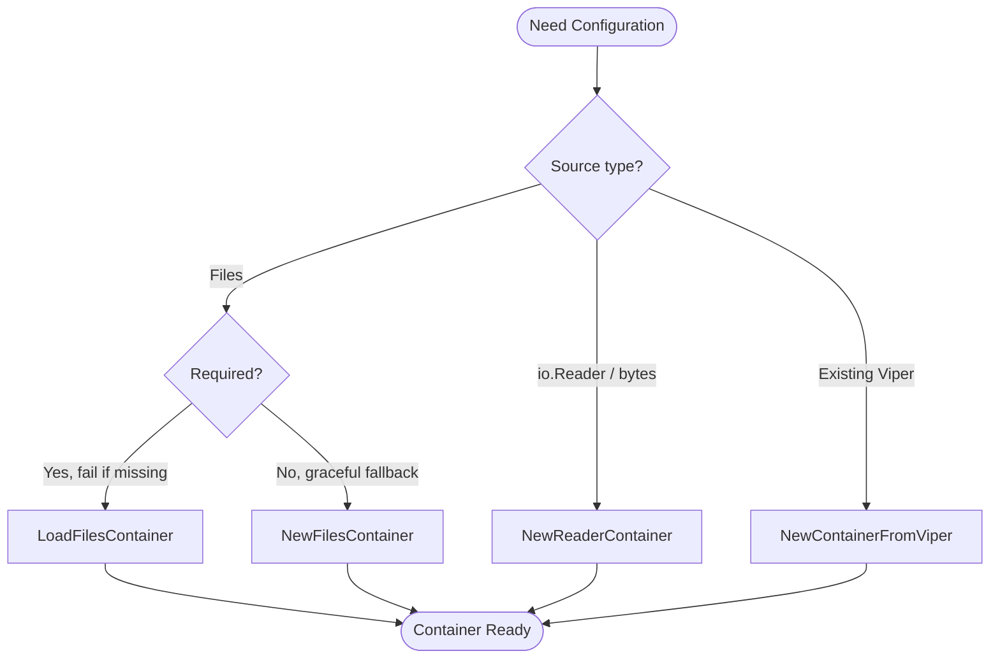

# Creating Configuration Containers

## Factory Function Selection Guide

GTB provides several factory functions for creating configuration containers. This section helps you choose the right one for your use case.

### Quick Reference

| Factory Function | Use Case | Error Handling | File Watching |
| :--- | :--- | :--- | :--- |
| `NewFilesContainer(fs, opts...)` | Application startup with optional files | Logs warnings, continues | ✓ Enabled |
| `LoadFilesContainer(fs, opts...)` | Strict loading where config is required | Returns error | ✗ Disabled |
| `LoadFilesContainerWithSchema(fs, schema, opts...)` | Strict loading with schema validation | Returns error | ✗ Disabled |
| `NewReaderContainer(fs, opts...)` | Testing or embedded config streams | Logs warnings, continues | ✗ Disabled |
| `NewContainerFromViper(l, v)` | Wrapping existing Viper instances | N/A | Depends on Viper |

### NewFilesContainer

**Best for:** Production applications where some config files may not exist.

```go
container := config.NewFilesContainer(fs,
    config.WithLogger(l),
    config.WithConfigFiles("config.yaml", "config.local.yaml"),
)
```

**Behavior:**

- Silently continues if files don't exist
- Logs warnings for parse errors but doesn't fail
- Automatically enables file watching for hot-reload
- Merges files in order (later files override earlier ones)

### LoadFilesContainer

**Best for:** Scenarios where configuration is mandatory.

```go
container, err := config.LoadFilesContainer(fs,
    config.WithLogger(l),
    config.WithConfigFiles("config.yaml", "config.local.yaml"),
)
if err != nil {
    return fmt.Errorf("configuration required: %w", err)
}
```

**Behavior:**

- Returns `ErrConfigFileNotFound` (match with `errors.Is`) if the **first** file doesn't exist — never a nil container with a nil error
- Subsequent files are optional (merged if present)
- No file watching (single load operation)
- Preferred for CLI tools that require explicit configuration

### NewReaderContainer

**Best for:** Testing and programmatic configuration.

```go
// From strings (testing)
configYAML := `
app:
  name: test-app
  debug: true
`
container := config.NewReaderContainer(fs,
    config.WithLogger(l),
    config.WithConfigFormat("yaml"),
    config.WithConfigReaders(strings.NewReader(configYAML)),
)

// From embedded bytes
container := config.NewReaderContainer(fs,
    config.WithLogger(l),
    config.WithConfigFormat("yaml"),
    config.WithConfigReaders(
        bytes.NewReader(defaultConfigBytes),
        bytes.NewReader(envSpecificBytes),
    ),
)
```

**Behavior:**

- Accepts `io.Reader` instead of file paths
- Must specify format explicitly ("yaml", "json", "toml")
- No file watching (readers are consumed once)
- Ideal for unit tests with controlled configuration

### NewContainerFromViper

**Best for:** Integration with existing Viper-based code.

```go
// When you already have a configured Viper instance
v := viper.New()
v.SetConfigFile("legacy-config.yaml")
v.ReadInConfig()

container := config.NewContainerFromViper(l, v)
```

**Behavior:**

- Wraps existing Viper without modification
- Inherits all Viper settings (watchers, env bindings, etc.)
- Useful for gradual migration to GTB patterns

### Decision Flowchart



---
