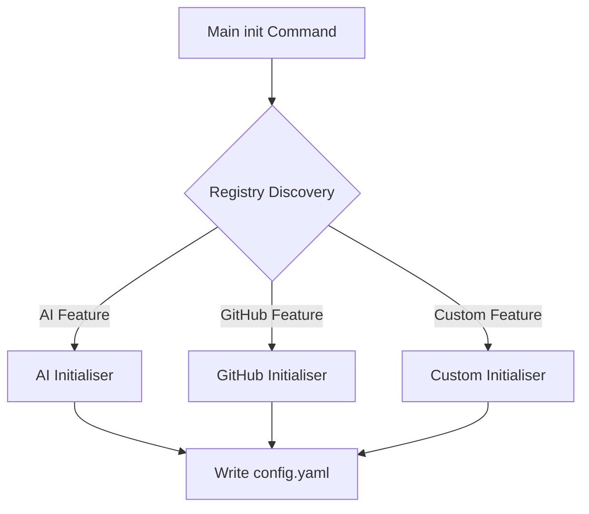

# Initialisers

This document provides a technical deep dive into the `Initialiser` interface, the lifecycle of an initialiser, and the specific implementation details of the built-in initialisers.

For a high-level conceptual overview of the Initialiser pattern, please see the [Initialisers Concept Documentation](initialisers.md).

## Interface Definition

The `setup.Initialiser` interface is the core contract for all initialization logic. It is defined in `pkg/setup/init.go`:

```go
type Initialiser interface {
    // Name returns a human-readable name for logging.
    Name() string
    // IsConfigured returns true if this initialiser's config is already present.
    IsConfigured(cfg config.Reader) bool
    // Configure runs the interactive config and writes values through cfg.
    Configure(ctx context.Context, p *props.Props, cfg Editor) error
}
```

`Configure` receives the caller's (command) context. It deliberately carries
no deadline of its own: interactive stages — forms, OAuth device flows — run
at human pace, and cancelling the context (Ctrl-C) aborts any in-flight
network or keychain call. Implementations must derive short per-operation
deadlines (`credentials.KeychainOpTimeout`) at each backend call site rather
than spanning interactive stages; a stage-wide deadline is exactly the defect
that killed OAuth logins before the 2026-07-23 context-scoping fix (spec
`2026-07-23-setup-credential-stage-context-scoping`).

`setup.Editor` is the read/write surface an initialiser uses during init:
`View()` returns a pinned `*config.View` whose reads resolve the target file
over the tool's embedded defaults, `Set(key, value)` writes one key, and
`Apply(changes...)` stages several `config.Change`s as one transactional
write — all through the store's `Apply`, editing the target document in place
so template comments survive the wizards. Credential wizards commit a
storage-mode switch through `setup.WriteExclusive`, which sets the winning
keys and removes every stale sibling in a single batch (the
single-credential-key invariant).


> [!NOTE]
> See [pkg.go.dev/gitlab.com/phpboyscout/go-tool-base/pkg/setup](https://pkg.go.dev/gitlab.com/phpboyscout/go-tool-base/pkg/setup) for the full API definition.


### Key Considerations for Implementers

1.  **Idempotency**: `IsConfigured` must be robust. It is called every time `init` is run. If it returns `false` incorrectly, the user will be prompted unnecessarily.
2.  **Configuration Isolation**: While the `setup.Editor` can write any key, an initialiser should ideally only modify keys relevant to its feature domain (e.g., `github.*` or `ai.*`).
3.  **Error Handling**: An error returned from `Configure` is logged as a warning ("configuration skipped") and the run continues with the next initialiser — the base config is still written. Return errors with explanatory context so that warning is actionable.

## Registration Lifecycle

Initialisers are registered via the `setup.Register` function, typically in a package's `init()` function.

```go
func Register(
    feature props.FeatureCmd,
    ips []InitialiserProvider,
    sps []SubcommandProvider,
    fps []FeatureFlag,
)
```

### The Registration Flow

1.  **Package Init**: When the application starts, packages invoke `setup.Register`. The setup package stores these providers in a global registry.
2.  **Command Construction**:
    *   The **Root Init Command** iterates over the registry.
    *   It checks `props.Tool.IsEnabled(feature)` to see if the feature is active.
    *   If active, it adds any registered `FeatureFlag`s to the root `init` command flags.
3.  **Command Execution**:
    *   When `init` runs, it calls `setup.Initialise`.
    *   `setup.Initialise` instantiates `Initialiser`s using the registered `InitialiserProvider`s.
    *   It iterates through them, calling `IsConfigured`.
    *   If not configured (and not skipped via flag), `Configure` is executed.

## Built-in Initialisers Implementation

### 1. Forge Initialiser (GitHub / Bitbucket)

**Package**: `pkg/setup/forge`

The forge initialiser is a single, provider-parameterised initialiser driven by a `Profile`. `NewGitHubInitialiser` runs the GitHub profile (single-token auth + SSH keys); `NewBitbucketInitialiser` runs the Bitbucket profile (dual `username` + `app_password` credentials). The interactive login and SSH-key upload are performed against the **configured forge provider** via the optional `forge.Authenticator` and `forge.KeyManager` capabilities — type-asserted on the registered provider. A provider that does not implement a capability returns `forge.ErrNotSupported`, which the wizard treats as "skip the automated step and tell the user to do it manually" rather than a hard failure.

The GitHub profile manages two distinct configuration areas: **Authentication** (OAuth device flow / token) and **SSH Keys**.

#### Configuration Keys
*   `github.auth.value`: The GitHub Personal Access Token (PAT).
*   `github.auth.env`: (Optional) Name of the environment variable holding the token.
*   `github.ssh.key.path`: Path to the private SSH key.
*   `github.ssh.key.type`: Type of key (e.g., `rsa`, `ed25519`) or `agent`.

#### Technical Workflow
1.  **Auth Check**: Checks for `GITHUB_TOKEN` env var. If present, it validates it against the GitHub API `user` endpoint. If valid, it skips prompting.
2.  **Token Prompt**: If no valid env var, it prompts the user to paste a token.
3.  **SSH Scan**: Scans `~/.ssh` for files matching standard patterns (`id_rsa`, `id_ed25519`, etc.).
4.  **Key Selection**: Uses `charmbracelet/huh` to present a list of found keys + a "Generate New" option.
5.  **Agent Support**: Can be configured to use `ssh-agent` instead of a direct key file.

### 2. AI Initialiser

**Package**: `pkg/setup/ai`

The AI initialiser abstracts over multiple LLM providers, normalizing their configuration into a common structure.

#### Configuration Keys
*   `ai.provider`: The selected provider identifier (`openai`, `claude`, `gemini`).
*   `ai.claude.key`: Anthropic API key.
*   `ai.openai.key`: OpenAI API key.
*   `ai.gemini.key`: Google Gemini API key.

#### Technical Workflow
1.  **Provider Selection**: User selects a provider from a list.
2.  **Key Input**: User inputs the API key.
    *   *Security Note*: The input field is masked (echo mode password).
3.  **Env Var Detection**: The initialiser checks for standard environment variables (e.g., `OPENAI_API_KEY`) corresponding to the selected provider.
    *   It displays a **warning note** in the UI if an env var is detected, informing the user that the env var will take precedence over the config file value they are about to set.
4.  **Persistence**: The provider choice and the specific key are written to the config file.

## Security Features

### Automatic `.gitignore` Generation

During `init`, if the config directory does not already contain a `.gitignore` file, one is automatically created to prevent accidental commit of sensitive files:

```
# Ignore files that may contain secrets
*.env
*.secret
*.key
```

Existing `.gitignore` files are never overwritten.

### API Key Detection Warning

After writing config files, the init process scans config files for common API key patterns (`sk-`, `api_key`, `token`, `secret`). If the config directory is inside a git repository, a warning is logged advising the user to ensure the config directory is gitignored. This provides defence in depth against accidental credential commits.

## Creating Custom Initialisers

For a step-by-step guide on implementing your own initialiser, referring to the [How-to Guide](../../../how-to/add-initialiser.md).


## Conceptual Overview

# Tool Initialisers

Initialisers are a core architectural pattern in GTB used to manage the configuration and bootstrapping of individual tool features in a decoupled, modular way.

## Purpose: Configuration, Not Logic

It is important to distinguish between **Configuration Initialisation** and **Functional Initialisation**:

- **Initialisers** are exclusively for ensuring that the `config.yaml` contains the necessary values (tokens, paths, preferences) for a feature to operate. This often involves interactive prompts, environment variable checks, or asset mounting.
- **Functional Initialisation** (the actual logic of how a feature behaves) remains firmly within your `NewCmd*` constructor and the `cobra.Command` execution logic.

In short: Initialisers prepare the *data* so that your *commands* can run.

## The Problem

Traditional CLI tools often have a monolithic `init` command that hardcodes every possible configuration step. This results in:

- **Brittle Code**: Adding a new feature requires modifying the core `init` command logic.
- **Bloated Binaries**: Features that aren't enabled for a specific project still carry their initialization logic.
- **Complex UI**: The `init --help` output becomes overwhelming with flags for features the user may not even be using.

## The Initialiser Solution

GTB solves this through **Self-Registering Initialisers**. Instead of the `init` command knowing about features, the features "tell" the framework how they want to be initialised and what flags they need.

### The Initialiser Interface

Any component that requires an interactive setup step (like a login or an API key input) implements the `Initialiser` interface:


> [!NOTE]
> See [pkg.go.dev/gitlab.com/phpboyscout/go-tool-base/pkg/setup](https://pkg.go.dev/gitlab.com/phpboyscout/go-tool-base/pkg/setup) for the full API definition.


### Self-Registration

Features register themselves with the framework during package `init()`. This allows the main `initialise` command to discover them dynamically based on what's enabled in the local tool's `props`.

A feature can register three things:

1. **Initialisers**: Logic to check and perform setup. These are executed by the main `init` command if the feature is enabled and not yet configured.
2. **Subcommands**: Standalone `init <feature>` commands. These are intended for **forced reconfiguration**. While the root `init` command will skip a feature if it's already configured, running the specific subcommand (e.g., `mytool init ai`) will trigger the setup process regardless of the current state.
3. **Flags**: Feature-specific flags (like `--skip-ai`) added to the main `init` command.



## How it works at Runtime

1. When you run `mytool init`, the framework fetches all registered items from the **Global Setup Registry**.
2. It filters these items based on `props.Tool.IsEnabled(feature)`.
3. It dynamically attaches any registered **Flags** to the `init` command.
4. Before any initialiser runs, it materialises the config file from the init template (`assets/init/config.yaml`, merged across every registered bundle) — seeding it when absent, or merging new template keys under an existing file.
5. During execution, it iterates through the **Initialisers**. If `IsConfigured()` returns false (and the feature isn't explicitly skipped via a flag), it calls `Configure()`; each `Set` is applied to the file in place as it happens, preserving the template's comments.

---

!!! note
    Initialisers are designed to be "aware" of the environment. For example, they can check if a specific environment variable override exists and skip interactive prompts automatically if a value is already provided.
