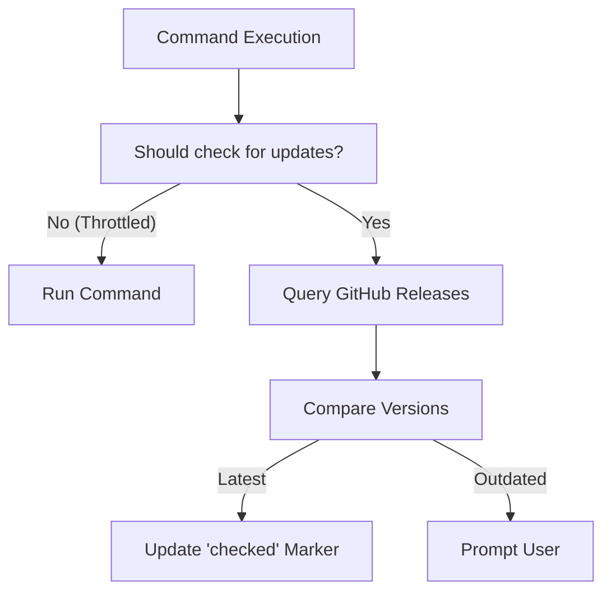

# Auto-Update Lifecycle

GTB includes a robust self-update mechanism that ensures users are always running the latest version of your tool without manual intervention. This system balances user convenience with operational stability.

## The Self-Update Workflow

The update process is typically split into two stages: **Discovery** and **Execution**.

### 1. Discovery (The Throttled Check)

To prevent overwhelming GitHub APIs and slowing down CLI usage, update checks are throttled using a file-based marker system.



- **Markers**: Status files (e.g., `last_checked`) are stored in the tool's config directory.
- **Throttling**: By default, checks occur at most once every 24 hours.
- **Command exemptions**: some commands never trigger the check, decided by typed command metadata rather than command names: anything wrapped with the `UpdateCmd`/`InitCmd` feature, and anything stamped with `setup.MarkSkipUpdateCheck` (`version`, `doctor`, `mcp` stamp themselves; a stamped group covers its whole subtree). Cobra's generated `help`/`completion`/`__complete` commands never reach the check at all — they take the root pre-run's [auxiliary fast path](setup/root-command.md#the-auxiliary-fast-path).
- **Consent default**: the update prompt defaults to **No**. If it cannot be answered — no TTY (cron, CI, piped stdin), or the user aborts — the update is declined rather than run. The tool continues with the current version; use the explicit `update` command (or `--ci`/`CI=true` to skip the check) for non-interactive environments.

### 2. Execution (Atomic Installation)

When an update is triggered, the `SelfUpdater` performs an atomic replacement of the running binary. This "bait and switch" approach is technically necessary because most filesystems (particularly Windows, but also many Unix-based systems) prevent writing to or deleting a binary file while it is actively being executed by the operating system.

The installation follows these steps to bypass this limitation:

1.  **Download**: The platform-specific `.tar.gz` asset is downloaded into memory.
2.  **Extract**: The binary is extracted from the archive.
3.  **Temp Buffer**: The new binary is written to a temporary file (e.g., `mytool_`) in the same directory as the current executable.
4.  **Swap**: The temporary file is renamed to the target filename (overwriting the old one), and permissions are set.

By writing to a temporary file first and then performing a rename, we ensure that the update is atomic—either it succeeds completely, or the old binary remains untouched.

## Key Components

### `SelfUpdater`
The core engine (`pkg/setup/update.go`) that communicates with GitHub, compares semantic versions, and manages the local filesystem during the update.

### `IsLatestVersion`
A method on `SelfUpdater` that compares the `CurrentVersion` (compiled into the binary via ldflags) against the latest GitHub release. It handles edge cases like future versions and development builds using `pkg/version.CompareVersions` and `IsDevelopment` detection.

### Downgrade guard

Checksum and signature verification authenticate that an artefact is a
genuine release — they say nothing about its **recency**. If the release
source reports a "latest" version *older* than the running binary (a stale
listing, a deleted newest release, or a rollback attack re-serving an old,
validly signed release), the implicit update path (`update` with no
`--version`) **refuses** with a non-zero exit rather than silently
downgrading. The refusal names both versions and hints at the sanctioned
routes:

- `update --version <tag>` — an explicit version is sufficient intent on its
  own, so a pinned downgrade needs no extra flag;
- `update --force` — overrides the guard on the implicit path.

The guard compares against the running binary version only (no persisted
high-water mark), and does not change development-build (`v0.0.0`)
behaviour, which already requires `--force` for any update. The throttled
background check merely *notifies* that the source reports an older latest;
it never applies a downgrade automatically. See
`docs/development/specs/2026-07-23-self-update-downgrade-guard.md`.

## Testability via Abstraction

The update system is designed to be fully testable despite its heavy reliance on the network and filesystem:
- **`vcs.GitHubClient`**: Injected to mock API responses.
- **`afero.Fs`**: Used for all filesystem operations, allowing the entire download/extract/swap flow to be verified in-memory.

## Offline Update Path

For air-gapped or restricted environments, the update system supports installing from a local `.tar.gz` archive via `UpdateFromFile`. This path skips both the Discovery and Download stages entirely — the binary is extracted directly from a pre-downloaded archive using the same atomic installation flow.

When a `.sha256` sidecar file exists alongside the archive, `VerifyChecksum` validates the file integrity before extraction. This matches the GoReleaser checksum output format.

See [Configure Self-Updating: Air-Gapped Environments](../../how-to/configure-self-updating.md#air-gapped--offline-environments) for the full workflow.

## Best Practices

- **Explicit Update Command**: Always provide an `update` command (via `setup.Register`) for users who want to force a sync manually.
- **Developer Safeguards**: The updater detects development versions (e.g., `v0.0.0`) and prompts for a `--force` flag to avoid accidental overrides of local builds.


## CLI Implementation & Architecture

## Online Update Process

1. Validates version format (if specified).
2. Downloads the target version from GitHub/GitLab.
3. Replaces the current binary.
4. Updates configuration files in standard locations.
5. Displays release notes for the new version.

## Offline Update (Air-Gapped Environments)

When `--from-file` is provided, the command bypasses all network calls:

```bash
# Standard offline update
mytool update --from-file /path/to/mytool_Linux_x86_64.tar.gz
```

If a `.sha256` sidecar file exists alongside the tarball (e.g., `mytool_Linux_x86_64.tar.gz.sha256`), the checksum is verified before extraction. If no sidecar is present, a warning is logged and installation proceeds.

No VCS client, API token, or network access is required for offline updates.

## Implementation

The update command is implemented in `cmd/update/update.go`. Online updates use `pkg/setup.NewUpdater()` while offline updates use `pkg/setup.NewOfflineUpdater()`.

### Injecting updater factories (testing)

`NewCmdUpdate`, `Update`, and the offline path accept `UpdateConfigOption`s. To substitute the updater in tests — without touching any package-level state — pass a factory option:

```go
cmd := update.NewCmdUpdate(props,
    update.WithUpdater(func(ctx context.Context, p *props.Props, version string, force bool) (update.Updater, error) {
        return myFakeUpdater, nil
    }),
    update.WithOfflineUpdater(func(p *props.Props) update.Updater {
        return myFakeOfflineUpdater
    }),
)
```

Each call site receives its own factory, so concurrent (`t.Parallel`) tests cannot clobber one another.

!!! warning "Deprecated: `ExportNewUpdater` / `ExportNewOfflineUpdater`"
    The package-level vars `ExportNewUpdater` and `ExportNewOfflineUpdater` are **deprecated**. They are mutable global test seams that race under parallel tests. They still work (consulted as the default when no option is given) and are retained for one minor release; migrate to `WithUpdater` / `WithOfflineUpdater`.

### Error handling in `init` subcommands

The `init ai`, `init github`, and `init bitbucket` subcommands use cobra `RunE` and **return** configuration errors rather than calling `logger.Fatalf`. Returning the error routes it through the framework's standard error path — user-facing hints, the configurable `ExitFunc`, and the deferred telemetry flush all apply — instead of terminating the process abruptly and bypassing them.

## Background update checks — the ForcedUpdate policy

On every non-`--ci` invocation the root command may run a throttled update
check. Its behaviour is governed by a **three-state policy** so a background
check never silently hijacks an unrelated command:

| Policy | When a newer release is found |
|---|---|
| `disabled` | Log that an update is available and **continue**. No prompt, no block. **Framework default.** |
| `prompt` | Ask "update now?"; **decline** continues with the command, **accept** updates then asks you to re-run. The `gtb` CLI itself uses this. |
| `enabled` | **Block** every command until updated. A declined or unanswerable required update exits **non-zero** (never a masked exit 0). |

**Resolution precedence:** `--ci` / `ci: true` bypass the check entirely → then
the `update.policy` config key → then the tool author's baseline
(`props.Tool.UpdatePolicy`, default `disabled`).

```yaml
update:
  policy: prompt        # disabled | prompt | enabled   (empty = tool baseline)
  check_interval: 24h   # any Go duration; 0 = check every invocation
```

A tool author sets the baselines on the `Tool`:

```go
props.Tool{
    // ...
    UpdatePolicy:        props.UpdatePolicyPrompt,
    UpdateCheckInterval: 7 * 24 * time.Hour, // optional; zero = framework default (24h)
}
```

**Check-interval precedence:** a valid `update.check_interval` config value
(where `0`/`0s` means "check every run") → the `props.Tool.UpdateCheckInterval`
baseline (if positive) → the framework default (24h). A zero-value baseline is
treated as "unset" and falls through to 24h, so an "every run" cadence is only
reachable via runtime config, never as a compiled-in baseline.

**Persistent out-of-date reminder.** The latest version discovered by a check is
cached in the `last_checked` marker's body (its modtime still drives the
`check_interval` throttle — one file, two jobs). While the running binary is
behind that cached version, a single `WARN` is emitted on **every** invocation
(even when the network check is throttled), so a user who declined — or who runs
a `disabled`-policy tool — keeps being reminded to upgrade. `--ci` suppresses it.

**Failed updates exit non-zero.** A successful update that needs a restart exits
0 and asks you to re-run; a *failed* update (e.g. no release asset for the
platform) propagates a non-zero exit rather than masking the failure as success.

See `docs/development/specs/2026-06-16-forced-update-feature.md`.
