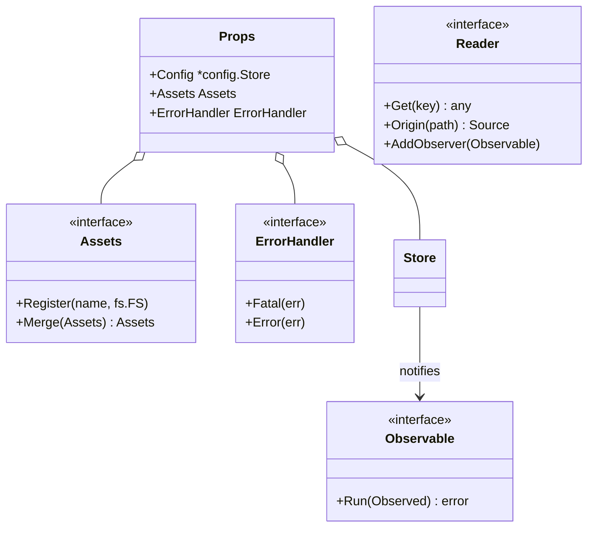

# Interface Design

GTB follows Go's interface design principles: small, focused interfaces that enable flexible composition, dependency injection, and comprehensive testing. This guide provides a complete reference to all public interfaces in the framework.

## Design Philosophy

GTB interfaces follow these key principles:

**Interface Segregation**
:   Interfaces are kept small and focused on specific behaviours rather than encompassing all possible methods.

**Accept Interfaces, Return Concrete — Except Provider Factories**
:   Functions accept interface parameters for flexibility. The default return is a concrete type for clarity. The deliberate exception is a *factory constructor* that selects among several interchangeable implementations behind one contract (the provider pattern): these return the interface, because the concrete type is an implementation detail the caller must not depend on. `chat.New` returns `ChatClient`, `errorhandling.New` returns `ErrorHandler`, and the `logger.New*` constructors return `Logger` for exactly this reason. A constructor with a single concrete implementation still returns that concrete type.

**Consumer-Defined Interfaces**
:   Interfaces are defined where they're consumed, not where they're implemented, following Go idioms.

**Testing First**
:   All interfaces are designed with testability in mind, enabling mock implementations via Mockery.

---

## Interface Reference

### Logging

#### Logger

**Package:** `pkg/logger`
**Purpose:** Unified logging abstraction accepted by all GTB packages instead of a concrete logger type.

```go
// Mirrors the method set of *slog.Logger exactly (see pkg.go.dev for the full
// signatures); a *slog.Logger therefore satisfies logger.Logger directly.
type Logger interface {
    Debug(msg string, args ...any)
    Info(msg string, args ...any)
    Warn(msg string, args ...any)
    Error(msg string, args ...any)
    // …Context variants, Log, LogAttrs
    With(args ...any) *slog.Logger
    WithGroup(name string) *slog.Logger
    Enabled(ctx context.Context, level slog.Level) bool
    Handler() slog.Handler
}
```

**Implementations:** `NewCharm` (CLI), `NewSlog` (observability stacks), `NewNoop` (tests)

**Key Design Decisions:**

- Mirrors `*slog.Logger` exactly, so a plain `*slog.Logger` satisfies it directly and any type with the same method set works as a custom backend — no adapter needed
- Structured-only: format-string helpers (`Infof`) and `Fatal` were dropped; use `log.Info("msg", "key", val)` and return errors for exit paths
- `Handler()` provides slog ecosystem interoperability; runtime level/format are set via the `logger.SetLevel(log, slog.Level)` / `logger.SetFormatter(log, f)` helpers rather than interface methods

**Usage Example:**

```go
l := logger.NewCharm(os.Stderr, logger.WithLevel(logger.InfoLevel))
props := &props.Props{Logger: l}
```

See [Logger component documentation](../components/logger.md) for the full backend reference.

---

### Props Provider Interfaces

GTB packages that need only a subset of `Props` declare narrow provider
interfaces. This makes dependencies explicit and keeps test setup minimal.

```go
type LoggerProvider interface {
    GetLogger() logger.Logger
}

type ConfigProvider interface {
    GetConfig() *config.Store
}

type ErrorHandlerProvider interface {
    GetErrorHandler() errorhandling.ErrorHandler
}
```

**Key Design Decisions:**

- Packages declare only the provider interfaces they need
- `*props.Props` satisfies all provider interfaces
- Tests pass a minimal struct implementing only the required interface

---

### Configuration Interfaces

#### Reader

**Package:** `go/config`  
**Purpose:** The read surface a consumer depends on — deliberately small and
free of any dependency's types, so what sits behind it can be replaced (as the
Store replaced Viper) without touching consumers.

```go
type Reader interface {
    Get(path string) any
    GetString(path string) string
    GetBool(path string) bool
    GetInt(path string) int
    GetFloat(path string) float64
    GetDuration(path string) time.Duration
    GetTime(path string) time.Time
    // ...the full typed-getter family, plus:
    Has(path string) bool
    IsSet(path string) bool
    SectionExists(path string) bool
    Keys() []string
    Unmarshal(target any) error
    UnmarshalKey(path string, target any) error
    Origin(path string) (Source, bool)
    Shadowed(path string) []Source
    Explain(path string) string
}
```

**Primary Implementation:** `*View` — a read surface **pinned to one
snapshot**, obtained from the live store with `store.View()`.

**Key Design Decisions:**

- Reads are snapshot-coherent: two values read from one view always belong to
  the same resolved configuration, even under hot reload
- Provenance is part of the read surface — `Origin`/`Shadowed`/`Explain`
  report which layer supplied a value
- Writes are deliberately absent: they go through the Store's transactional
  `Apply`, which edits the target document in place

**Usage Example:**

```go
func loadDatabaseConfig(cfg config.Reader) (*DatabaseConfig, error) {
    section, err := config.UnmarshalSection[DatabaseConfig](cfg, "database")
    if err != nil {
        return nil, err
    }

    return &section.Value, nil
}
```

---

#### Observable

**Package:** `go/config`  
**Purpose:** Configuration change notification callback.

```go
type Observable interface {
    Run(cfg Observed) error
}
```

`Observed` embeds `Reader` and is pinned to the snapshot that triggered the
notification, so an observer never reads values from a later change partway
through its own callback.

**Usage Example:**

```go
type ConfigReloader struct {
    service *MyService
}

func (r *ConfigReloader) Run(cfg config.Observed) error {
    return r.service.Reconfigure(cfg)
}

store.AddObserver(&ConfigReloader{service: myService})
```

---

### Asset Management

#### Assets

**Package:** `pkg/props`  
**Purpose:** Unified access to embedded filesystems with automatic merging.

```go
type Assets interface {
    fs.FS
    fs.ReadDirFS
    fs.GlobFS
    fs.StatFS
    
    Slice() []fs.FS
    Names() []string
    Get(name string) fs.FS
    Register(name string, fs fs.FS)
    For(names ...string) Assets
    Merge(others ...Assets) Assets
    Exists(name string) (fs.FS, error)
    Mount(f fs.FS, prefix string)
}
```

**Primary Implementation:** `*embeddedAssets`

**Key Design Decisions:**

- Composes standard library `fs.*` interfaces for compatibility
- Named registration enables selective asset access
- Automatic YAML/JSON/CSV merging across registered filesystems

**Usage Example:**

```go
// Register assets from multiple packages
p.Assets.Register("core", &coreAssets)
p.Assets.Register("myfeature", &featureAssets)

// Access merged configuration
file, err := p.Assets.Open("config.yaml")  // Merges all config.yaml files

// Access specific asset set
docs := p.Assets.For("core")  // Only core assets
```

---

### Error Handling

#### ErrorHandler

**Package:** `pkg/errorhandling`  
**Purpose:** Centralised error processing with logging, help display, and exit handling.

```go
type ErrorHandler interface {
    Check(err error, prefix string, level string, cmd ...*cobra.Command)
    Fatal(err error, prefixes ...string)
    Error(err error, prefixes ...string)
    Warn(err error, prefixes ...string)
    SetUsage(usage func() error)
}
```

**Primary Implementation:** `*StandardErrorHandler`

**Key Design Decisions:**

- Separates error logging from exit behaviour (testable)
- Supports multiple severity levels
- Integrates rich stack traces, hints, and details via `cockroachdb/errors`

**Usage Example:**

```go
func myCommand(p *props.Props) *cobra.Command {
    return &cobra.Command{
        Run: func(cmd *cobra.Command, args []string) {
            err := doWork(args)
            p.ErrorHandler.Fatal(err)  // Logs and exits if err != nil
        },
    }
}
```

---

### AI Integration

#### ChatClient

**Package:** `pkg/chat`  
**Purpose:** Unified interface for AI provider interactions.

```go
type ChatClient interface {
    Add(prompt string) error
    Ask(question string, target any) error
    SetTools(tools []Tool) error
    Chat(ctx context.Context, prompt string) (string, error)
}
```

**Implementations:** OpenAI, Claude, and Gemini clients (internal)

**Key Design Decisions:**

- Provider-agnostic interface hides API differences
- Tool calling abstraction enables agentic workflows
- `Ask` supports structured JSON responses

**Usage Example:**

```go
type Analysis struct {
    Issues []string `json:"issues"`
    Score  int      `json:"score"`
}

client, _ := chat.New(ctx, props, chat.Config{Provider: chat.ProviderClaude})
var result Analysis
client.Ask("Analyse this code for issues", &result)
```

---

### Service Lifecycle

#### Controllable (composed interface)

**Package:** `pkg/controls`
**Purpose:** Manage multiple concurrent services with coordinated lifecycle.

`Controllable` is a composition of four focused role interfaces:

```go
// Runner: lifecycle and service registration.
type Runner interface {
    Start()
    Stop()
    Status() HealthReport
    IsRunning() bool
    IsStopped() bool
    IsStopping() bool
    Register(id string, opts ...ServiceOption)
}

// StateAccessor: read access to controller state and context.
type StateAccessor interface {
    GetState() State
    SetState(state State)
    GetContext() context.Context
    GetLogger() logger.Logger
}

// Configurable: controller configuration setters (used by ControllerOpt).
type Configurable interface {
    SetErrorsChannel(errs chan error)
    SetMessageChannel(control chan Message)
    SetSignalsChannel(sigs chan os.Signal)
    SetHealthChannel(health chan HealthMessage)
    SetWaitGroup(wg *sync.WaitGroup)
    SetShutdownTimeout(d time.Duration)
    SetLogger(l logger.Logger)
}

// ChannelProvider: access to controller channels.
type ChannelProvider interface {
    Messages() chan Message
    Health() chan HealthMessage
    Errors() chan error
    Signals() chan os.Signal
}

// Controllable composes all five interfaces.
type Controllable interface {
    Runner
    HealthReporter
    StateAccessor
    Configurable
    ChannelProvider
}
```

**Primary Implementation:** `*Controller`

**Key Design Decisions:**

- Narrow role interfaces allow packages to declare only what they use — most consumers only need `Runner`, `HealthReporter`, or `ChannelProvider`
- `ControllerOpt` functions accept `Configurable`, not `Controllable`, to enforce the narrowest dependency
- `SetLogger` accepts `*slog.Logger`; wrap an application `logger.Logger` with `logger.ToSlog(...)` at the call site
- Built-in OS signal handling for graceful shutdown

---

### Version Control

#### RepoLike

**Package:** `pkg/vcs`  
**Purpose:** Abstract Git repository operations for local and in-memory repos.

```go
type RepoLike interface {
    SourceIs(int) bool
    SetSource(int)
    SetRepo(*git.Repository)
    GetRepo() *git.Repository
    SetKey(*ssh.PublicKeys)
    SetBasicAuth(string, string)
    GetAuth() transport.AuthMethod
    SetTree(*git.Worktree)
    GetTree() *git.Worktree
    Checkout(plumbing.ReferenceName) error
    CheckoutCommit(plumbing.Hash) error
    CreateBranch(string) error
    OpenInMemory(string, string, ...CloneOption) (*git.Repository, *git.Worktree, error)
    OpenLocal(string, string) (*git.Repository, *git.Worktree, error)
    Open(RepoType, string, string, ...CloneOption) (*git.Repository, *git.Worktree, error)
    WalkTree(func(*object.File) error) error
    AddToFS(fs afero.Fs, gitFile *object.File, fullPath string) error
}
```

**Primary Implementation:** `*Repo`

**Key Design Decisions:**

- Polymorphic switching between local filesystem and in-memory storage
- Functional options for clone configuration
- Integration with `afero.Fs` for test isolation

---

#### GitHubClient

**Package:** `pkg/vcs`  
**Purpose:** GitHub Enterprise API operations.

```go
type GitHubClient interface {
    GetClient() *github.Client
    CreatePullRequest(ctx, owner, repo string, pull *github.NewPullRequest) (*github.PullRequest, error)
    GetPullRequestByBranch(ctx, owner, repo, branch, state string) (*github.PullRequest, error)
    AddLabelsToPullRequest(ctx, owner, repo string, number int, labels []string) error
    UpdatePullRequest(ctx, owner, repo string, number int, pull *github.PullRequest) (*github.PullRequest, *github.Response, error)
    CreateRepo(ctx, owner, slug string) (*github.Repository, error)
    UploadKey(ctx, name string, key []byte) error
    ListReleases(ctx, owner, repo string) ([]string, error)
    GetReleaseAssets(ctx, owner, repo, tag string) ([]*github.ReleaseAsset, error)
    GetReleaseAssetID(ctx, owner, repo, tag, assetName string) (int64, error)
    DownloadAsset(ctx, owner, repo string, assetID int64) (io.ReadCloser, error)
    DownloadAssetTo(ctx, fs afero.Fs, owner, repo string, assetID int64, filePath string) error
    GetFileContents(ctx, owner, repo, path, ref string) (string, error)
}
```

**Primary Implementation:** `*GHClient`

---

### Initialisation

#### Initialiser

**Package:** `pkg/setup`  
**Purpose:** Pluggable initialisation steps for CLI tools.

```go
type Initialiser interface {
    Name() string
    IsConfigured(cfg config.Reader) bool
    Configure(props *props.Props, cfg setup.Editor) error
}
```

**Implementations:** GitHub initialiser, AI initialiser, custom feature initialisers

**Key Design Decisions:**

- Self-registration via feature registry
- Idempotent—checks existing config before prompting
- Decoupled from core init command logic

---

## Interface Relationships



---

## Testing with Interfaces

All interfaces have auto-generated mocks in `mocks/pkg/`:

```go
import (
    "testing"
    mocks_config "gitlab.com/phpboyscout/go/config/mocks"
)

func TestMyFunction(t *testing.T) {
    mockCfg := configmocks.NewMockReader(t)
    mockCfg.On("GetString", "api.url").Return("http://test.example.com")
    mockCfg.On("GetInt", "api.timeout").Return(30)
    
    result := MyFunction(mockCfg)
    
    mockCfg.AssertExpectations(t)
}
```

### Generating Mocks

Mocks are generated using Mockery. After adding a new interface:

```bash
task mocks  # or: mockery
```

---

## Creating New Interfaces

When designing new interfaces for your GTB application:

### 1. Keep Interfaces Small

```go
// ✓ Good: Focused interface
type Reader interface {
    Read(key string) ([]byte, error)
}

// ✗ Avoid: Kitchen sink interface
type DataStore interface {
    Read(key string) ([]byte, error)
    Write(key string, data []byte) error
    Delete(key string) error
    List(prefix string) ([]string, error)
    Watch(key string, callback func([]byte)) error
    Transaction(func(tx Tx) error) error
    // ... many more methods
}
```

### 2. Define Where Consumed

```go
// Define interface in the package that uses it
package mycommand

// FileReader is what mycommand needs to read files
type FileReader interface {
    ReadFile(path string) ([]byte, error)
}

func NewCommand(reader FileReader) *cobra.Command {
    // ...
}
```

### 3. Accept Interfaces, Return Concrete (Factories Excepted)

Accept interfaces and, by default, return the concrete type so callers keep
full access to the implementation:

```go
// ✓ Good: single implementation — accept interface, return concrete
func NewService(cfg config.Reader) *MyService {
    return &MyService{cfg: cfg}
}

// ✗ Avoid for a single implementation: returning the interface needlessly
//   hides the concrete type
func NewService(cfg config.Reader) ServiceInterface {
    return &MyService{cfg: cfg}
}
```

The exception is a **factory constructor** that picks one of several
interchangeable implementations behind a shared contract. Here returning the
interface is correct — the concrete type is intentionally hidden so the caller
cannot couple to a specific provider:

```go
// ✓ Good: factory over multiple providers — return the interface
func New(ctx context.Context, p *props.Props, cfg Config) (ChatClient, error) {
    switch cfg.Provider {
    case ProviderClaude:
        return newClaude(ctx, p, cfg)
    case ProviderGemini:
        return newGemini(ctx, p, cfg)
    // ...
    }
}
```

This is why `chat.New`, `errorhandling.New`, and the `logger.New*` constructors
return interfaces rather than concrete structs.

---

## Related Documentation

- **[Props Container](../components/props.md)**: How interfaces compose in the central dependency container
- **[Mocks Package](../components/mocks.md)**: Using generated mocks for testing
- **[Error Handling](../components/error-handling.md)**: ErrorHandler interface patterns
- **[Configuration](../components/config/index.md)**: Store, Reader and Observable usage
