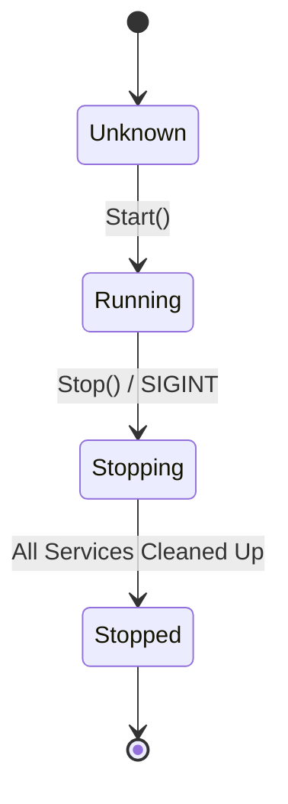

# Service Orchestration & Control

!!! info "The supervisor lives in the standalone `go/controls` module"
    The service-lifecycle supervisor was **extracted into
    [`gitlab.com/phpboyscout/go/controls`](https://controls.go.phpboyscout.uk)**. Unlike
    some extracted components it has **no GTB adapter**: it is framework-free (its only
    seam is a nil-safe `*slog.Logger`), so go-tool-base consumes it **directly**, callers
    `import "gitlab.com/phpboyscout/go/controls"` and use its functional-options API as-is.
    The concepts below are unchanged; only the import path moved. See the
    [Controls component page](../components/controls/index.md) and the
    [migration note](../../reference/migration/v0.x-controls-extracted.md).

The `go/controls` package provides a standardized way to manage long-running background services. It handles the complexities of concurrent execution, health monitoring, and graceful shutdowns, ensuring that your CLI application remains stable and responsive.

## The Controller Pattern

The `Controller` is the central orchestrator that manages a collection of `Services`. It abstracts away the manual management of goroutines, wait groups, and shutdown sequencing.

### Key Components

- **`Controllable` Interface**: Defines the contract for any component that can be managed by the controller.
- **`Service` Struct**: A simple wrapper around three primary lifecycle functions: `Start`, `Stop`, and `Status`.
- **Channels**: The "nervous system" of the controller, using typed channels for:
    - **`Messages`**: Processing control signals (e.g., `Stop`, `Status`).
    - **`Health`**: Streaming host/port status and heartbeat messages.
    - **`Errors`**: Centralized reporting of background service failures.
    - **`Signals`**: Handling OS-level signals like `SIGINT` and `SIGTERM`:
      **opt-in only**, via `controls.WithSignals()`. Inside a GTB command the
      root command already owns signals, so the controller observes the
      cancellation of `cmd.Context()` instead of registering a competing handler.

## Specialized Server Controls

For common server types, GTB provides specialized sub-packages that simplify integration:

- **`pkg/http`**: Standardized HTTP/TLS server with production timeouts and security defaults.
- **`pkg/grpc`**: Standardized gRPC server with reflection support.

These packages provide `Start` and `Stop` functions that return the `StartFunc` and `StopFunc` types required by the `Controller.Register` method.

Cross-cutting request concerns on these servers (logging, auth, rate limiting, circuit breaking) are configured as middleware/interceptor chains at registration time (`WithMiddleware`/`WithInterceptors`), not in the lifecycle hooks. See [Transport Middleware & Resilience](transport-middleware.md).

## Lifecycle Management

The `Controller` manages a service's state through a clean lifecycle flow:

### Run outcomes and restart semantics

Each supervised run of a service's `Start` is classified into one of three explicit outcomes, and **only an error triggers a restart**:

- **Clean start**: `Start` returned `nil`. This is the common case for a server that spawns its listener in a background goroutine: returning `nil` means "started successfully", *not* "exited". The controller never restarts a clean start; it supervises such a service via its `Status`/health check (when a `RestartPolicy` with a `HealthFailureThreshold` is configured) and otherwise simply waits for shutdown.
- **Context cancelled**: the run ended because the controller context was cancelled (graceful shutdown), or `Start` returned a *valid* terminal error (see below). Never restarts.
- **Error**: `Start` returned a genuine error while the context was still live. This is the only outcome that may trigger a restart, subject to the `RestartPolicy`.

The restart counter measures **consecutive failures**, not lifetime restarts: after a service has run healthily for the `RestartResetInterval` (default 30 s, configurable via `WithRestartResetInterval`), the counter resets to zero. The controller **never sends `nil`** on the error channel.

`WithValidError(func(error) bool)` registers a predicate identifying expected terminal errors (e.g. `http.ErrServerClosed`, `context.Canceled`). A matching error is treated as a graceful end-of-run: it neither counts toward the restart total nor is forwarded as a failure.

### Graceful Shutdown

Handling shutdowns correctly is critical, especially when services hold file locks or open network connections. The controller handles this through two primary triggers:

1.  **OS Signals**: Traps `SIGINT` and `SIGTERM` to initiate a stop sequence. Signal handling is registered only after construction options are applied, so `WithoutSignals` truly leaves the default OS disposition in place (no orphaned `signal.Notify`). The registration is detached via `signal.Stop` when the signal channel is swapped out or at shutdown. A **second** signal arriving during shutdown forces the signal-handler goroutine to exit so a wedged shutdown can be escalated.
2.  **Context Cancellation**: Listens to the parent `context.Context` and triggers a shutdown if the context is cancelled.

When a stop is triggered, the controller stops services in **reverse registration order**, one at a time, so the last-started service stops first (respecting startup dependencies). Each `StopFunc` runs under the shutdown deadline: a context-ignoring stop is **abandoned** when the deadline elapses rather than hanging `Wait()` forever. The controller then waits for all goroutines to finish via a `sync.WaitGroup`.

`Start` is **idempotent**: it transitions `Unknown → Running` under a compare-and-set, so a second `Start()` is a safe no-op that does not double-start services or double-count the wait group. Services registered without a `Start` or `Stop` function default to no-ops, so they never panic at start or shutdown.

The controller's internal goroutines (error/context handler, signal handler, message processor) all terminate when shutdown completes: none busy-spins on a cancelled context or leaks past `Wait()`.

## State & Thread Safety

To prevent race conditions during lifecycle transitions, the `Controller` uses a `sync.Mutex` to protect its internal `State`. State transitions use an internal `compareAndSetState` method that atomically checks the current state and sets the new state, preventing check-then-act races. For example, concurrent `Stop()` calls are safe: only the first caller performs the shutdown; subsequent calls are no-ops. This allows other components of the application to safely query `IsRunning()`, `IsStopping()`, or `IsStopped()`.

## Best Practices

- **Context-Aware Functions**: `StartFunc` and `StopFunc` receive a `context.Context` parameter. Use this context for cancellation and timeout handling rather than creating your own.
- **Channel Buffering**: Use appropriate buffering for error and signal channels to prevent background services from blocking during high-volume events.
- **Logging**: The controller accepts an optional `*slog.Logger`. Always provide a logger to ensure service transitions and background errors are visible to the user.
- **Context Awareness**: Background services should always respect the `context.Context` provided by the controller for internal task cancellation.

**See also:** the signal-aware execution lifecycle that wires `SIGINT`/`SIGTERM` into the root command's run context, documented in [Commands: Root § Signal Handling](../../reference/cli/root.md#signal-handling-and-exit-codes).
