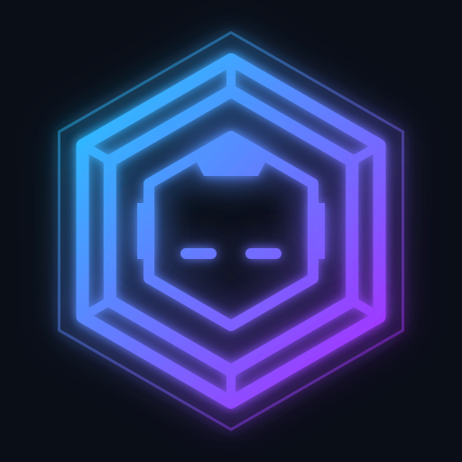
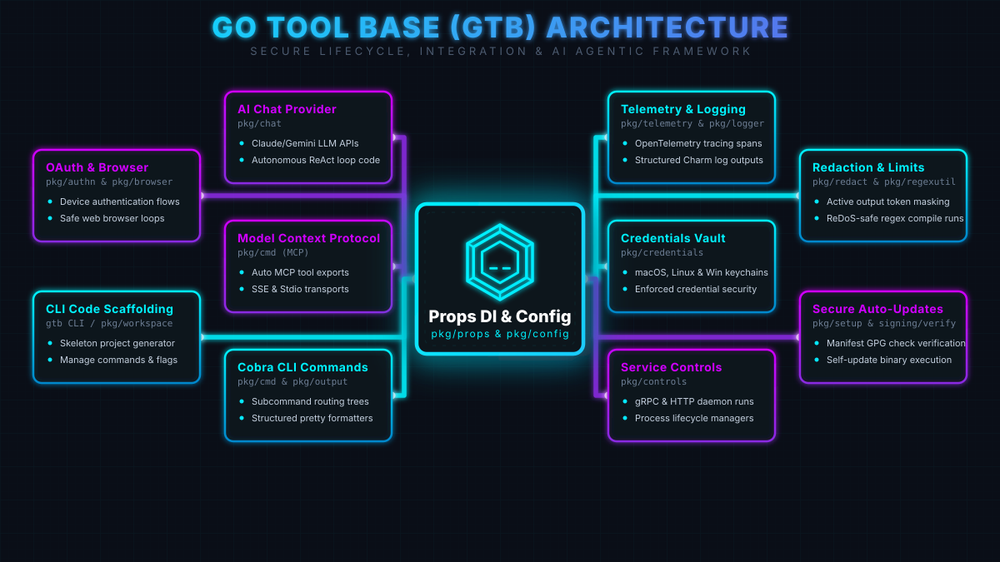

<div class="hero-container">
  <div class="hero-text" style="flex: 1; text-align: center; display: flex; flex-direction: column; align-items: center;">
    <div class="hero-logo-wrapper">
      <video class="hero-logo" autoplay loop muted playsinline>
        <source src="images/branding/mascot_animation_1.mp4" type="video/mp4">
        
      </video>
    </div>
    <h1 class="hero-title">Go Tool Base</h1>
    <p class="hero-subtitle">The Intelligent Lifecycle Framework for Go CLIs</p>
    <p class="hero-description" style="max-width: 800px; margin-left: auto; margin-right: auto;">
      Modern CLI tools and DevOps workflows demand more than basic flag parsing. GTB works as a "batteries-included" micro-framework, providing a standardized foundation for building mission-critical tools with built-in agentic workflows, hardware-backed credentials vaults, OpenTelemetry observability, and zero-config service management.
    </p>
    <div class="install-box" style="margin-left: auto; margin-right: auto;">
      <span class="install-command">curl -sSL https://gtb.phpboyscout.uk/install.sh | bash</span>
      <span class="install-copy" title="Copy to clipboard">📋</span>
    </div>
    <div class="hero-buttons">
      <a href="getting-started.html" class="btn btn-primary">Get Started</a>
      <a href="concepts/index.html" class="btn btn-secondary">Learn Concepts</a>
    </div>
  </div>
</div>

<div class="hero-banner-diagram">
  
</div>

## Why GTB?

Before diving into code, we highly recommend reading our positioning guides to understand if GTB is the right fit for your next project:

- **[What is GTB?](about/why-gtb.md)** — Core philosophy, "IS / IS NOT" framing, and the 8 key advantages.
- **[Framework Comparison](about/comparison.md)** — Direct comparisons with Cobra, Viper, urfave/cli, and web frameworks.
- **[Coming from other Ecosystems?](about/coming-from-other-ecosystems.md)** — A translation guide for developers migrating from PHP (Laravel), Ruby (Rails), or Python (Django).

## Overview

GTB accelerates development by providing a standardized Dependency Injection (`Props`) container pre-wired with essential features. It includes multi-source configuration, automatic version checking, structured logging, and an AI service layer—allowing you to focus entirely on your unique business logic.

## Key Features

<div class="features-grid">
  <div class="feature-card">
    <div class="feature-icon">🚀</div>
    <h3>CLI Code Scaffolding</h3>
    <p>Generate skeleton projects, manage commands, and scaffold flags in seconds with the GTB toolchain.</p>
  </div>
  <div class="feature-card">
    <div class="feature-icon">🤖</div>
    <h3>AI Chat Provider</h3>
    <p>Integrated support for Claude, Gemini, and OpenAI APIs to power autonomous ReAct-style loops against your code.</p>
  </div>
  <div class="feature-card">
    <div class="feature-icon">🔌</div>
    <h3>Model Context Protocol</h3>
    <p>Expose your CLI commands automatically as MCP tools for external AI agents over SSE and Stdio transports.</p>
  </div>
  <div class="feature-card">
    <div class="feature-icon">📊</div>
    <h3>Telemetry & Logging</h3>
    <p>Built-in OpenTelemetry tracing spans and beautiful structured Charm log outputs for zero-config observability.</p>
  </div>
  <div class="feature-card">
    <div class="feature-icon">🔐</div>
    <h3>Credentials Vault</h3>
    <p>Native integration with macOS, Linux, and Windows keychains to enforce robust credential security.</p>
  </div>
  <div class="feature-card">
    <div class="feature-icon">📦</div>
    <h3>Secure Auto-Updates</h3>
    <p>Zero-config version syncing, GPG manifest verification, and self-update capabilities via GitHub/GitLab releases.</p>
  </div>
</div>


## Built-in Commands

Every CLI tool built with GTB automatically includes the following commands with a cli tool:

- **`init`** - Initialize tool configuration and setup
- **`version`** - Display version information and check for updates
- **`update`** - Update the tool to the latest version
- **`docs`** - Interactive documentation browser with AI capabilities
- **`mcp`** - Expose your tool's capabilities via the Model Context Protocol

## Quick Start

```go
package main

import (
    "embed"
    "os"

    "gitlab.com/phpboyscout/go-tool-base/pkg/cmd/root"
    "gitlab.com/phpboyscout/go-tool-base/pkg/errorhandling"
    "gitlab.com/phpboyscout/go-tool-base/pkg/logger"
    "gitlab.com/phpboyscout/go-tool-base/pkg/props"
    "gitlab.com/phpboyscout/go-tool-base/pkg/version"
    "github.com/spf13/afero"
)

//go:embed assets/*
var assets embed.FS

func main() {
    l := logger.NewCharm(os.Stderr, logger.WithTimestamp(true))

    p := &props.Props{
        Tool: props.Tool{
            Name:        "mytool",
            Summary:     "My awesome CLI tool",
            Description: "A tool that does amazing things",
            ReleaseSource: props.ReleaseSource{
                Type:  "github",
                Owner: "myorg",
                Repo:  "mytool",
            },
        },
        Logger:  l,
        Assets:  props.NewAssets(props.AssetMap{"root": &assets}),
        FS:      afero.NewOsFs(),
        Version: version.NewInfo("1.0.0", "", ""),
    }
    p.ErrorHandler = errorhandling.New(l, p.Tool.Help)

    rootCmd := root.NewCmdRoot(p)
    root.Execute(rootCmd, p)
}
```

## CLI in Action

See how Go Tool Base builds and executes interactive lifecycle commands in real-time:

<div class="video-container">
  <video controls autoplay loop muted playsinline class="landing-video">
    <source src="tapes/basic-demo.mp4" type="video/mp4">
  </video>
</div>

<div class="cta-banner">
  <h2>Ready to Build Next-Gen CLIs?</h2>
  <p>Whether you want to scaffold a new project in seconds or integrate into a complex enterprise tool, Go Tool Base gives you the developer-focused lifecycle infrastructure out-of-the-box.</p>
  <div class="cta-buttons">
    <a href="getting-started.html" class="btn btn-primary">Get Started Now →</a>
    <a href="how-to/index.html" class="btn btn-secondary">Explore 50+ How-to Guides</a>
  </div>
</div>
